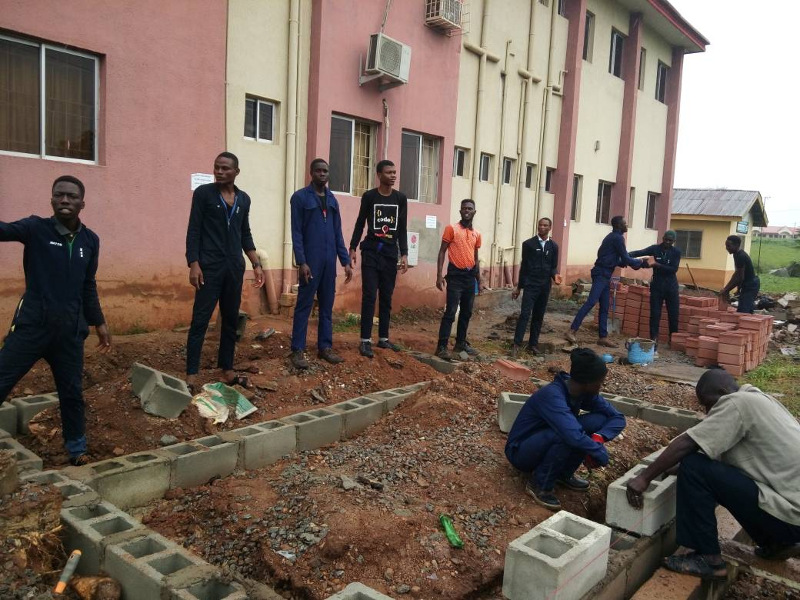
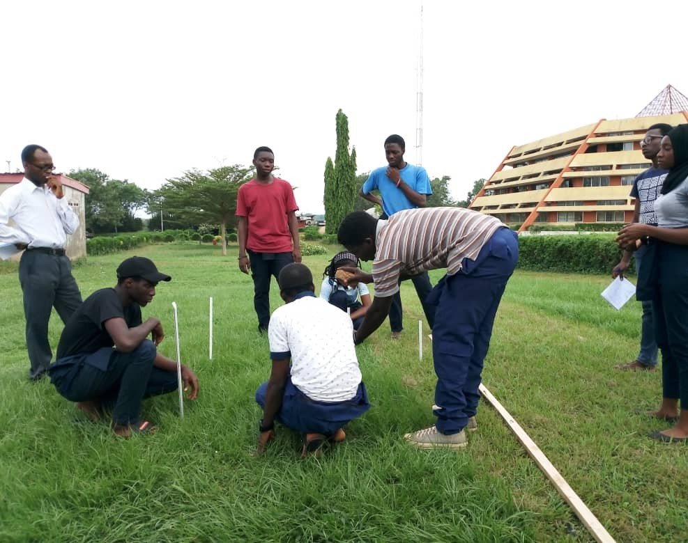
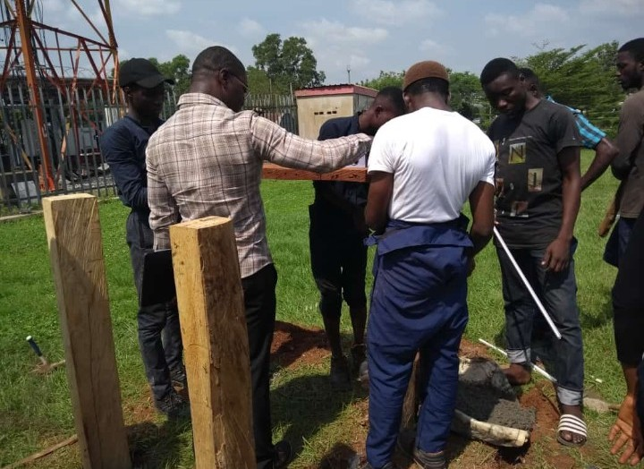

_Joshua Oyadokun didn't find Mechatronics by searching for it. It found him. Before university, he had already worked through automobile engineering, taught himself mobile and laptop repairs, and picked up hands-on electrical experience across home and industrial sites. When he finally opened a JAMB brochure and saw the word "Mechatronics," something clicked. Here was a course that looked exactly like the life he had already been living._

_But Joshua's story isn't just about finding the right course. It's about what you do with the time in between. Between secondary school and university, between graduation and a stable job, between a startup idea and the money to fund it, Joshua kept moving. He joined associations he wasn't sure about, ran for positions he wasn't certain he'd win, and used the unexpected free time that COVID brought to keep learning, building, and experimenting._

_In this interview, as part of our AMTES Alumni Series, Joshua looks back on the sleepless nights in COLBIOS classrooms, the leadership roles that quietly shaped him, and what it really felt like to build a system touching 160 million Nigerians. His story is one of someone who never had a perfect plan, but never stopped moving forward either._

**Hi, Joshua! Welcome. I'm actually really excited to have this interview with you because you were one of the first seniors I met when I was in 100 level. I just really want to learn about and speak to you today.**
 
Well, I really hope I don't disappoint you. 

**I'm sure you won't. So first things first, I usually like to get to know people's story on how and why they got into mechatronics before moving on to other parts of their journey. So my first question is, you mentioned you have a diploma in automobile engineering, and then you went on to study mechatronics. Why did you choose Mechatronics, and what drew you to this field?**

I guess I’d have to give you a little backstory for that. After my WAEC in 2013, my mom felt I needed to learn a skill, something that could support me while I was in school. I came across this technical school that offered automobile engineering, and it felt like a no-brainer because of how much I love cars. Low cars, fast cars, anything cars. I just wanted to try it out and see where it would lead.

While in the technical school, we were also advised to take up some kind of apprenticeship with local mechanics, so I did that too. The program itself was just a year, but after completing it, getting an internship with workshops in Nigeria was really tough. Things just weren’t working out at that point, so I switched paths a bit.

That was when I moved on to computer engineering—let me not even package it. I went to Computer Village in Ikeja to learn how to fix laptops. I also did a bit of electrical apprenticeship; I had an uncle who always took me to different sites to fix things and handle home and industrial electrification. So, basically, I touched mobile repairs, computer repairs, and some electrical work too.

When I sat for JAMB in 2015 and was about to choose a course, I originally wanted mechanical engineering. But then I saw something called “Mechatronics” in the brochure, and I was like, “What’s this one again?” I did a bit of research, mostly from the FUNAAB website and Wikipedia, because that was all I had at the time, and realized it was like a combination of everything I’d been doing. The mobile repair from technical school, my experience with laptops, and the electrical work I did with my uncle. When I discovered Mechatronics, I was like, “Wow, this actually looks perfect for me.” It felt like everything aligned, so I just went for it. That was how I got into the catalyst that pushed me toward Mechatronics.

Fun fact, all these things I learned that were supposed to be a source of income for me during school, like a side hustle to support myself, I basically ended up doing most of them for free. I can remember fixing people’s phones, laptops, and even doing electrical work, all for free. Honestly, I’m a very bad businessman. Looking back, that was not the smartest decision at all. But funny enough, all those decisions, and that whole path, are what eventually pushed me into Mechatronics. They all came from the same engineering root, just different branches.

**Exactly. One common theme I've noticed with almost everyone that I've spoken to is that they just found mechatronics by accident.**

I think the course wasn’t popular back then. Around 2016, it was still very new, and schools were just beginning to develop it. Honestly, anybody who claims they knew about it from way back, I feel like they’re not being truthful. Mechatronics only started becoming mainstream recently, and that’s when people really began to notice it. But yeah, that was just how it was.

**We're going to move on to the next question, and this is just going to cover your whole academic journey. So what was your academic journey like? Were there moments when you struggled with certain courses? How did you push through those struggles? What was your most memorable moment as a student in FUNAAB? Did you maybe have lecturers, mentors or even your departmental mates that you feel like made the experience really memorable?**

I think I should start with my first year, back in 2016. Between finishing secondary school in 2013 and entering university in 2016, I had gone through a lot. I wasn’t as strong or motivated as I used to be. I had tasted a bit of little money, so I wasn’t really interested in university anymore. I mean, if I were going to school to make money and I was already doing that, why not stick to it? My mom didn’t agree with that. 

100 level wasn’t too tough for me academically. I basically had to revise most of what I had learned before, and since the courses weren’t too difficult at that stage, I ended up with a pretty good GPA. I had above a 4-point in both semesters, so it was pretty good, or at least I consider it good.

**Yes, everyone considers it good.**

In 200 level, I thought I could chase love. I really believed I could balance everything, so there was this girl I was trying to talk to. In my head, I was like, “Yes, this is going to work.” I carried the matter on my head like it was my life assignment. But in the end, I dropped the ball. My GPA dropped, too. I had something above 3.5 but below 4.0. And to make things worse, I fell sick during my second semester exams. So 200 level really wasn’t a great time for me.

Academically, I didn’t struggle with the courses themselves because I had a solid group. It was my guys and I, we used to spend nights reading together in the classrooms in COLBIOS, COLAMRUD and in the auditorium. We’d teach each other, organize mini-lectures, revise topics, and just grind. Those nights were some of my most memorable times in school.

At some point, I started doing calculations and permutations in my head and realized I could never make a first-class again. That really discouraged me, and I started wondering what the point was. But eventually, I told myself that even if I couldn’t hit first-class, I would get something very close. And that mindset helped.

300 level was great. It felt like I got my rhythm back. We didn’t do SWEP in 200 level like other sets. When we finally did it, it was actually fun. We went around Dufarms, did some basic engineering work, and even built a restroom beside the Civil Engineering building. I still have pictures of it. It turned out really nice.

That experience helped me bond with my coursemates. Before then, I didn’t really interact with most people. But working together like that, sweating under the sun, building something physical, it brought us together in a way regular group assignments never could.

So that was how we did our SWEP back then. 

For my IT in 400 level, I actually split it across two places. The first was an industrial automation firm that handled a lot of work for food and beverage companies. But honestly, I got tired. I realized that wasn’t what I wanted to do. It was heavily electrical, lots of cabling, wiring, and industrial setups, and I just didn’t see myself doing that long-term. So after about three months, I left.

Then I moved to another place in Ajah to complete the IT. That was where I got my first real introduction to robotics working with Arduinos, sensors, programming, all of that. It opened my eyes. Around that time, COVID hit, so we ended up having almost a full year free. I took that as an opportunity to practice. I ordered some kits from AliExpress, stayed home, and just kept learning and experimenting.

I built a lot of small projects, wrote code, burned components, fixed them, spoiled them again, you know the drill. That experience helped me a lot when it was time for my final-year project. I can’t even remember if I chose the project topic myself or if it was assigned, but building and designing the system felt natural because of all the practice I had already done.

But that doesn’t mean it was easy. There were days I genuinely cried out of frustration. Some errors refused to go. Some code just wasn’t making sense. I struggled, but it was worth it in the end. All of that shaped my academic journey in Mechatronics.

Aside from academics, I also have some non-academic stories. Most of them were leadership or politically inclined. I joined the engineering student engineering association without really knowing why, maybe because I had a friend who encouraged me. There was also this push for our department to have more visibility within the college, since the majority representation always seemed to come from other engineering departments.

I decided to run for a AGS, and before I knew it, I was doing the actual work. I had to meet with various school officials, including our staff adviser, and I even went to Senate a couple of times. I didn’t meet the VC, but I met his secretary often. Those experiences put me in contact with top people in the school, and it opened my eyes. We discussed programs, got advice, and planned activities for the faculty and the association.

All of that made me realize how much I enjoyed leadership. I loved helping people—students, juniors, everyone. And I also noticed that our department was practically invisible on campus. That motivated me to run for president when I got to 500 level.

Outside engineering associations, I was also a director in an international leadership organization. I served as Director of Programs and Projects. We handled several community-based initiatives—like book drives where we donated books to secondary school students and educated them on different topics. It was a lot of impact work.

Mixing academics with all this wasn’t easy. By 300 level, things became intense. My earlier plan didn’t work out, so I had to look for new ways to grow. That’s when I really leaned into leadership and community-building.

**I really like that your answers are very indepth. You talked about your leadership experience earlier, and that actually leads me to my next question. You mentioned serving with JCI, taking the AGS role for NUESA and eventually becoming the AMTES president for the 2020/2021 session.**

**A lot of students see leadership positions as something that doesn’t really matter, like they can’t actually make an impact or that it’s just for show. They don’t always recognize the value these roles bring.**

**So I want to ask: what did these experiences teach you about leading people, and how have they shaped the way you approach teams and projects today? Because I remember you said earlier that at first, you didn’t even know why you joined the association. So I’m curious, did the value of those roles become clearer over time?**

Yes, definitely. Joining the association was really a push from the past president. I think he was also the first president who happened to be a member of JCI as well. We met at one of the meetings on a Sunday, and I approached him to ask about the department, what the plan was to push us forward and make us more visible.

He explained that we needed proper representation, especially at the college level and even at the ACG level if possible, because honestly, nobody from our department was really showing up in those spaces. And that got me thinking: if I want progress, and if I keep saying I care about the department, what am I doing about it?

He asked me what my plans were for the next election, and at first I brushed it off, saying I didn’t have time and that balancing everything would be too much. It was book they sent me to come and read. But after that meeting, I kept thinking about it. Eventually, I picked up the form for the AGS position. I think the form was around 3 to 5k, it felt like a lot at the time. But I told myself that even if I didn’t win, at least I made the move.

That was the first real push into the whole leadership structure. And once I got in, I told you how I started meeting the principal bodies of the school and getting exposed to how things actually work behind the scenes. It’s really nice to have people who genuinely have your best interests at heart at those levels. That was what pushed me, and honestly, most of these leadership experiences helped me personally as well.

After my NYSC, when I got my first job in 2022, I joined a team of five. We had two developers, and we were building projects for the government at the time. Eventually, our team lead had to travel abroad for his master’s, and someone needed to step in for him.

He called me into his office one day and said he’d noticed the way I interacted with people, how I motivated the team, how I organized things, the same habits I picked up back in school from leadership roles. He said those qualities were exactly what the team needed, and he wanted me to step into the role.

I was hesitant at first. I wasn’t sure if I was ready, but deep down I really wanted it. And he added a nice bonus to the offer, so that helped too.

That ended up being my first professional leadership position, and it went really well. We delivered the project on time, which was the most important thing, and everything just clicked. Looking back, I’m honestly not sure I would’ve gotten that opportunity if I hadn’t taken up leadership roles back in school.

It really confirmed something I always say: nothing you do is ever wasted. Everything comes back one way or another. So if you have the chance, and if it won’t interfere with your studies, go for leadership roles. You never actually “have time,” but if you want it badly enough, you’ll find the balance.

**I think I really agree with that. I actually came across the flyer you created when you were contesting for AGS, and now I can’t find it on my phone anymore. I’ll still look for it though.**

Yeah, I actually designed it myself. 

**I can’t remember exactly what it looked like, but I remember having it at some point. The fact that you put the whole thing together yourself is actually very nice, because when I contested for AGS in 300 level, I had to reach out to a friend to help me with my own design.** 

But now that you’re describing it, I feel like I need to see it again, because I can’t remember exactly how it looked. If you find it, please send it to me as well.

**Of course. On the next question, you mentioned that after graduating from FUNAAB, you tried to start your own robotics firm. I honestly applaud that, it was very bold and courageous. You mentioned that you had some limitations, was it hardware, finances, or both, that eventually made you put the idea on hold for a bit. I’d love for you to walk us through that journey.**

**What were some of the things you learned along the way? What was the hardest part of that experience? And finally, what would you say was your biggest takeaway from trying to start your own robotics firm?**

Yes, I guess it started with the feeling that I had just completed my final year project. I thought, if I could do that, maybe I could do something bigger, something that could work on a larger scale and potentially generate revenue. After all, I had spent the last four or five years studying this course, so the next step naturally felt like trying to build something for myself.

The hardest part of the startup journey was coming up with ideas or products that people would actually want. I realized I couldn’t just create something because it sounded cool. At one point, I had some ideas for agriculture-related robots, like a robot that could plant, feed, and clean in a farm setting. But when I looked into sourcing the materials online, mainly through AliExpress, I found the prototype alone would have cost over $500—way beyond what I had at the time.

I didn’t even have access to some of the essential hardware, so I pivoted to learning ROS, which allowed me to keep building my skills without needing expensive equipment. I also did some creative writing and other small jobs to raise funds whenever I could, because basic needs always came first.

Eventually, I realized I could save my startup ideas for later while focusing on projects I could actually execute in the meantime. Even now, I still think about new ideas every day, but for the time being, I’ve shifted focus and haven’t returned fully to that original robotics startup.

Honestly, it was mainly the cost of hardware that was holding me back. I also had discussions with some of my colleagues, but we were all broke at the time. So those ideas just ended up on the shelf. I kept telling myself, “Tomorrow, I’ll start it,” and that became a running joke with me.

There was this greenhouse beside the MTE building made with tarpaulin. It was meant to be our  SWEP project back in 2019. We had different team members working on each part, and even though it was a small project, it gave us an experience in managing and executing something tangible.

So, that’s basically the full picture of my startup experience. Even though I had to pause, I’ve never stopped thinking about it, and honestly, I fully intend to pick it back up again when the timing is right. I think I will tomorrow.

**We’re getting an insider exclusive! We also have someone from our department taking the entrepreneurship route. Have you heard of [Gasfeel](https://www.gasfeel.com/) before?**

Oh, that’s good. Yeah, I’ve seen some flyers and papers about it.

**Yes, the founder is also from MTE. Hearing your story about starting a company, and then seeing someone else also take the entrepreneurship route, I find it really inspiring. There are so many problems out there that need solving, and while some people prefer the traditional 9-5 life, it’s amazing to see others step up and try to create change, just like you mentioned when we spoke about leadership.**

**At the moment, I don’t feel much of a risk-taker, so I don’t have that entrepreneurship spirit yet. Seeing people take that step amazes me because I know it requires so much effort, more than we often realize.**

**I just want to commend you for doing this fresh out of school. You took the risk, and if you eventually create actual standard robotics company, it becomes something for people like us to aspire to work with. So, thank you for chasing that dream and taking that step, and it’s exciting to know you’re planning to continue it tomorrow.**

Yeah, it’s also amazing to see people doing this. It’s not easy, especially coming out of college. Most people are comfortable with the 9-5 route, but that’s also a risk because you can get laid off at any point. For me, that’s just a means to an end, it’s a way to get the resources to try out ideas, build software, and test things until one of them takes off. Even small experiments, averaging just $10–$15 a month for nearly a year, can lay the groundwork for bigger things.

**That’s a nice way to see things. You mentioned your job, and that actually leads smoothly into our next question. The transitions have been smooth so far. In your current role, you focus on developer experience and tooling. For anyone who doesn’t know what that means, how would you explain it simply? What do you enjoy about it? And do you feel there’s anything you wish you had done more of in school to prepare for the industry?**

Regarding developer experience, I see myself as a developer for developers. We have developers who focus on customer features, they push features, work on the backend, and handle various services. What I do is research the current workflow: how an idea moves from a pull request all the way to production, and identify pain points along the way. What I do day-to-day is get an overview of this process. 

I mostly focus on command-line tools and workflows that help them work faster. My job is to make sure they’re happy in their roles and can deliver features efficiently so they can focus on the customers.

What I enjoy about my job, cause I really love it, is the research aspect. Previously, in my old role, I was a full-stack engineer. I did apps, mobile, web, backend, everything. I got tired of being spread so thin. Every day felt like just creating endpoints or small parts, and I wanted to do more than that. Now, in this new role, I get to focus on research and understanding tools deeply, really understanding how they work. That’s what makes it exciting for me.

So in this new role, research is a big part of what I do. There is no single day I don’t do research or a single tool or workflow I don’t investigate. I don’t just use the tools, I also study why they work, how they work, and propose improvements. I guess what I really enjoy about my job is that research aspect. I get to dig into why things behave the way they do, explore solutions, and even build frameworks or small fixes to make things better.
 
It’s that feeling of discovery, of learning what’s really going on in the background, that I love. The whole process of testing, building, and retrying gives me a sense of accomplishment and understanding.

**Uh-huh.**

I also enjoy the unpredictability. Not knowing exactly how things will behave keeps me engaged.

As for what could have prepared me for this job in school… honestly,  I’m not using much of the standard coursework right now. It’s more the problem-solving mindset and curiosity that really matter in this role. I don’t think more than 20% of what we learned in school is directly useful. Most of the curriculum was heavily theoretical, and there wasn’t much in practical software application.

For example, in mechatronics, we focused a lot on mechanical engineering courses, and in software, only a couple of 500-level courses touched on practical coding. Most of what I really use today, I learned from YouTube videos and hands-on experience on the job. So I’ve had to take extra lessons personally, outside of formal education, to make up for those gaps. Honestly, if I had really leaned into practical projects and external learning while in school, things would have been much easier.

**Well, I think this is my first time hearing about your role and then hearing you break it down and just speak about the fact that it keeps you on your toes. It sounds really exciting.**

Yeah, I mean, you wake up and there are always new libraries or tools to test out. Things that help reduce latency or handle new trends in the industry. You really have to do research on these tools and be ready to answer questions from management. I can’t just say, “It works”; I need to understand it inside and out, because I’m talking to people with backgrounds in computer engineering, computer science, and programming.

When I started, I actually did a lot of hands-on work. I would demo systems, and they’d ask, “What does this do?” and I had to explain the whole process. Sometimes, I’d realize something was wrong, so I’d go back and fix it. It’s fun because you hop from one GitHub repository to another website, download source code yourself, and really dig into what things do. It’s exciting.

**Yeah, it really sounds like it is. Okay, moving on to our next question, question six. We’re past the halfway mark. If you compare what you thought life after school would be like versus what it actually turned out to be, what do you feel is the biggest difference?**

So the biggest difference is the field I’m currently in. My dream right after graduation was to start a new startup. By the second day, I was building systems to help farmers, support homes, and reduce stress.

I realized I hadn’t fully considered the costs. Some of the expenses were partially covered by me and my family, so when I had to handle them myself, I realized that I had been daydreaming a bit. 

I’d really love to get back into hardware engineering at my earliest convenience, actually touching and feeling what I’m doing, not just typing on a keyboard and seeing results on a screen, is what excites me.

So, the major difference is really the field I’m in now. 

**Thanks. I think this next question might be even more exciting than the last one. Do you see yourself returning to the entrepreneurship route, or are you more focused on building a long-term career in the software industry?**

No, definitely not for now. I mean, I like entrepreneurship, but my current goal is to go to grad school and also set up a mini robotics lab in Nigeria. I feel like we’re at a disadvantage compared to our counterparts in first-world countries. There’s a huge practical gap in hands-on learning that needs to be filled as soon as possible. It’s been my dream to build a real robotics lab in Nigeria that could even be used in schools. I definitely plan to do it.

**Absolutely. I might not have enough context but I think some African countries have it better than we even do in Nigeria. I recently attended a conference and saw how they are doing better in terms of basic robotics infrastructure. For example, CMU Africa has an impressive robotics program. And I also met a professor at the University of Cape Town who runs a lab, the [African Robotics Unit](https://africanroboticsunit.com/), I think it’s called ARU, and what they’re doing is really remarkable.**

**Meanwhile, in Nigeria, we barely have anything comparable. It’s a huge gap, and I feel like building this lab could really help bridge that and provide opportunities for young engineers here.**

Not to the best of my knowledge right now. I’ve also really not seen or heard of such. I really don’t know what the problem is and we’re meant to be the giants of Africa. Maybe we’re like second now. That gap has been there for over 10 years now. I started mechatronics in 2015 and things are still the same way.

**Exactly. And we have the talent. We have innovators. If we just had the right systems, we’re definitely going to thrive.**

There’s something there. I don’t want to talk too much about the government, but for me, the focus is on building systems and opportunities.

**You mentioned graduate studies, and that actually leads nicely into our next question. Graduate studies are on your radar, so what questions, projects, or areas are you most excited to explore during your MSc? And why not a PhD, for now, at least?**

Yeah, so I actually wanted to do an MSc first because I wanted to test the waters before committing to that long PhD journey. For the past 2–3 months, I’ve been thinking about it a lot and I’ve been convinced to go for the thesis route, just so I can focus on research immediately. So my research interests are mostly in machine learning and robotics in particular. I’m trying to find better algorithms and better systems.

I’m basically building on my undergraduate project. Back then, I built an autonomous system, but I’m not trying to rebuild that exact thing. I’m looking for answers to the problems I faced during that project. 

One of the biggest issues was the navigation system. The navigation code had so many limitations. For that project, if you said, “Go here,” the robot would just go. It didn’t really “think.” So there wasn’t any optimal path-planning system. That’s what I’m hoping to work on now. Because for that project, the robot didn’t process or adapt. It would just follow instructions blindly. That’s not efficient. So I’m now looking for ways we can have something more intelligent.

Recently I’ve done a lot of reading on reinforcement learning for navigation systems. I also spoke with someone recently, and we’re exploring how we can use graph-based systems too. The idea is to improve navigation for critical-response robots, that is robots used for exploration or disaster recovery. For example, if there’s a building collapse or an earthquake, you need a robot with a very robust system that can navigate, and find people to rescue. So I’m basically looking into how different ML algorithms can improve navigation in disaster-response robots.

**Nice. Wow. And the irony is, I’m part of this ML research community, and we have different subgroups. In the robotics focus group, what we’re working on is actually autonomous navigation too. Ever since we finalized the topic, I keep seeing autonomous navigation everywhere. And now you’re talking about it too, and I’m like, wow, there are actually a lot of people interested in this space.**

Hmm, hmm. You’re right, there’s a lot going on in this area. A lot of people are working on it and pushing the boundaries.

**OK, so this is question 9. You mentioned earlier that you’ve worked on a lot of projects for government agencies like financial systems, biometric systems and more. Can you tell us about the first big project that you had to handle, and what it was like stepping into that level of responsibility?**

So, the first big project… I don’t even know if I should call it “big” or “intense,” but let me just say it as it is. It was a project for one of Africa's largest mobile network operator and government organization. Basically, we were building a biometric system for validating and verifying user details, so anytime you wanted to pull someone’s record or register a new identity, that system handled it.

And the funniest part was during development. We were running everything locally in Docker, and we had maybe 1,000 or 2,000 records in our dev environment. And of course, it was blazing fast. We were feeling like, “Ah, we’ve cracked it. We’ve made it.” Then I went on-site. And that was when reality slapped us.

We had a few issues. The system refused to start. The real database was beyond the 1,000 or 2,000 records we tested, it was 160 million. One hundred and sixty million. 

**What??**

So all the queries that worked perfectly during development basically fell apart in production. The first crazy challenge for me was optimizing those queries. Something that took 500 milliseconds in dev was already “too slow” at that scale. We had to get things down to 2–3 milliseconds in some cases. That was when I realized, “Okay, this is a serious system.” Because millions of people were going to depend on it every day.

**Yeah, that’s huge.**

It really was. I mean, it’s one of those things where during testing you’re like, “Yeah, everything is fine, good to go.” Then you deploy, and suddenly the whole thing is crawling.

So we had to do a lot of optimization. But honestly, that was what made it exciting for me, seeing that you could take a system that was struggling and beat it down into something extremely efficient. We had to go deep into optimization, restructuring queries, refactoring logic, everything.

For example, queries that would normally take one second, we were able to bring them down to around 10 milliseconds. And that part really got me excited, because it pushed me into research mode and I genuinely loved that part of the process. It was challenging, but in a good way.

**Wow. Wow, that’s amazing. 160 million people… wow. But yes, we’re on our last question. You’ve walked the engineering path, you’ve tried entrepreneurship, and now you’re working in industry. If you had a piece of advice to give to our current engineering students, or anyone who comes across this article and is still in school, what would that advice be?**

Mhm…, I guess the first thing is: **try to have very good results**. A first class, if possible. That’s basically your primary assignment in school. What is worth doing is worth doing well. I know some people say grades don’t matter, but honestly, having a strong result opens doors for you at certain points in your life. There are opportunities you’ll come across that require a particular CGPA, and you won’t even be able to apply, not because you’re not capable, but because you don’t have the required result. So if you can get it now, it will serve you later.

The second thing is: **try to be social. Go out, meet people, talk to people**. It really won’t help you to stay locked in all the time. You meet people who could become angel investors, people who have connections in places you’d never imagine. Those encounters don’t happen when you’re isolated. You have to step out, join communities, join associations. And these things also build your soft skills, learning how to work with people, how to lead people, how to speak confidently in public. Those skills will help you just as much as your technical knowledge.

The third thing is: **you can also try to build a business or a brand while you’re still in school**. You actually have an advantage there because you're surrounded by a lot of people you can relate with. It’s slightly harder outside —not impossible, just harder —but in school, it’s easier to build something from scratch.  When you’re within that school environment, everyone is pretty much on the same level. You can meet someone randomly and plug them into your business, or even get your first customers simply because of proximity. So yes, take advantage of that.

So in summary: **Get very good grades, very important. Network as much as you can. And try to build a business or brand, even if it’s small.**

Those engineering or technical side projects can really help, because honestly, we don’t know what the future holds for anyone.

**Yeah, actually. Wow. Thank you so, so much. It was really nice speaking to you, especially after so long, and learning about what you’ve been up to, the things you’ve done, and what life after school looks like for you. I’m currently in my final year, which is crazy because the first time we met, you were in final year and I was in 100 level. So speaking to you and seeing how things have turned out, and are still turning out, it has made me a lot more optimistic. I’m in that phase where I’m like, “Oh my God, by this time next year I won’t be in school anymore. I have to start figuring life out.” It’s crazy.**

I guess it’s always like that. You feel like the buffer is gone. No more lectures, no more structure. And honestly, it hits you on the day you sign out, like the day you complete everything. You start looking ahead and trying to figure things out. It’s exciting, but at the same time, it’s also a bit scary. 

**Very true. Thank you again for giving us your time. Like I said, it was really nice speaking to you.  I’m really excited to put this out as well so that our readers can learn from you too.**

_Joshua’s story shows that you don’t need to have everything figured out to start making progress. Following your curiosity, trying new things, and being willing to learn from mistakes can open doors you never imagined._

_From building small projects to leading his peers and stepping into his first big professional role, Joshua’s journey is a story of patience, persistence, and quiet courage. He dreams of building a robotics lab in Nigeria, creating opportunities for the next generation of engineers, and he’s proof that one step at a time can lead to something meaningful._

_For every student still figuring things out, his path is a reminder that curiosity, effort, and caring about what you do can take you far._

_From all of us at AMTES, we celebrate you!_

_You can connect with him on [LinkedIn](https://www.linkedin.com/in/joshua-oyadokun/)._

