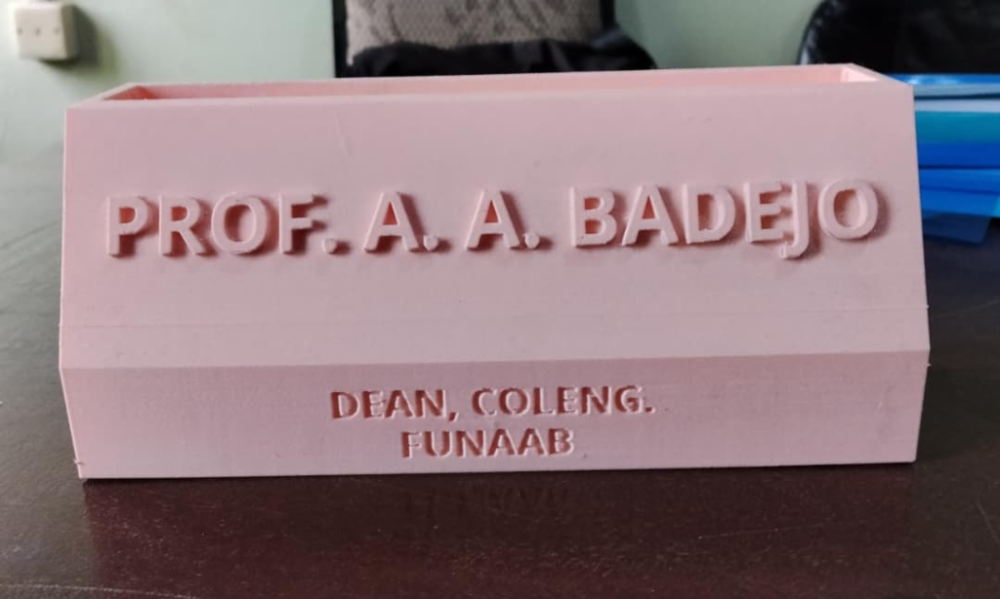

The last few weeks have been a plethora of activities, simulations, steep learning curves, and a lot of generic words I would have loved to put here. 

However, the story isn't really about me and my learning journey, it's about what you can learn from it. So, what do you need to know about ROS, CAD, and Research? Well, it coincidentally cuts across industry-standard robotics. 

### Let's start with Research

Research is wide....broad....imponderable in fact. However, as engineers, particularly in our field of learning, we have a very intriguing piece of the pie. It's no news that the world is evolving towards more intelligent systems and advanced robotics. Everyday, engineers all around the world are exploring new methods of design, implementation, and testing of these systems while documenting and comparing their results to previous versions or standardized benchmarks. This in itself is **RESEARCH**. 

However, West Africa (as of now) seems to be in the dark in this extremely fast-paced paradigm of robotics research. We do projects to be fair, lots of them in fact, but we aren't solving new problems. You rarely see Nigerians/West Africans contributing in global-staged robotics conferences (such as CoRL, Asys Symposiums, etc.), frontier research, or workshops, all because we aren't doing anything particularly **NEW** or **Novel**. One of the leading problems in robotics right now is `Resource Constrained Learning`, and it's majorly about deploying even more intelligent systems on less compute. Similar to the previous episode, it's all about efficiency and less compute. This is where you hear buzzwords like EdgeAI and TinyML. 

#### What's EdgeAI and TinyML?

* **Edge AI** applies to any device doing local processing instead of using the cloud. This includes high-power systems like an NVIDIA Jetson running an object detection model at 30 Watts of power, or a smartphone processing face-unlock metrics.
* **TinyML (Tiny Machine Learning)** is when you take those AI models, shrink them down drastically, and flash them onto microcontrollers that run on milliwatts of power—often tight enough to run on a small coin-cell battery for months. 

In ETH Zurich, researchers developed a "system-algorithm co-design" to run a state-of-the-art navigation CNN (DroNet) directly on a commercial nano-drone (the CrazyFlie 2.0). Their methodology involved building a custom "PULP-Shield" using a Parallel Ultra-Low-Power (GAP8) processor, and applying several optimizations such as quantization, memory tiling, memory reuse, and parallelization. In simple terms, they made a fully autonomous nano-drone weighing 27 grams and a few CM in size consuming 64mW while processing 6 frames per second. At peak performance of 18 frames per second, it consumes 284mW. 

Quantization, pruning, knowledge distillation, and neural architecture search remain the core model-compression toolkits, but this side is really ML heavy so I'd leave it to the ML Research gods (Teebarh, Ileri, and Danchi) to discuss in other posts.

In a nutshell, I'm particularly intrigued by this and would love to see how researchers from West Africa would contribute to resource-constrained architecture, especially with our very obvious limitations and environment. 

---

### Moving on......CAD!

CAD, CAM, and CNC are the industry manufacturing techniques you can't escape (for the sake of freshers reading this, it stands for Computer-Aided Design, Manufacturing, and Numerical Control). I recently had to throw Windows 11 out the window and install Linux Ubuntu, so I can't use the traditional CAD software such as Fusion360, TinkerCAD, etc. But mere software can't stop me, and while looking for a solution, I stumbled on **Onshape**. Onshape is a web-based CAD software with tons of resources, plugins, and user-made tools. 

CAD is essential in Additive Manufacturing and rapid prototyping. I strongly recommend making a physical sketch and having proper measurements of anything you want to design before opening your computer. This is imperative due to the fact that you won't want to find out you made a slight mistake in your design after waiting 3 hours for your Raspberry Pi Case to print and now it's totally useless (based on true events). The department has a new Bambu Lab 3D printer and as a SIWES student in the lab, let's just say it's been fun. Within a few days of learning I already designed and 3D printed customized PenHolder prototypes:

---

### And finally, ROS

ROS stands for **Robot Operating System** and it's the backbone of all modern robotics. Most robotics projects you see on YouTube simply compress all functions, variables, and code blocks into a single file. It works for small DIY projects, but the moment you add more functionalities or integrate more components, it becomes unreadable, non-modular, and not sustainable. Your simple obstacle-avoiding robot with a few extras now develops subtle issues, some parts stop functioning properly, and it becomes really difficult to operate most times. Think of it like having HTML, CSS, and JavaScript all in one long `index.html` file versus an optimized Next.js application with services, hooks, and reusable components. It's way better. 

Although ROS is for advanced projects and would require a Raspberry Pi and the likes, it's worth learning if you want to work on industry-grade projects. There are also other distributions of ROS that can run on certain ESP modules, but forget Arduinos....they are really limited here. New models such as Arduino Uno Q, R4 and others are being released with much more capabilities, some with AI. As you delve deeper into embedded systems and robotics, you start seeing the limits of Arduinos & ESPs, forcing you to either optimize or upgrade. I would be starting a whole new series on this titled *"Microcontrollers: The part YouTube doesn't teach"* where we'd discuss further. 

> ROS (Robot Operating System) uses a modular architecture based on nodes, topics, publishers, and subscribers. Instead of one large program controlling the entire robot, each component runs as an independent node with a specific responsibility. These nodes communicate by publishing and subscribing to topics.
>
> Consider an autonomous rover with a LiDAR, depth camera, LED indicators, DC motors, and a central controller.
>
> * **LiDAR Node** publishes distance data to `/scan`.
> * **Depth Camera Node** publishes image and depth data.
> * **Obstacle Detection Node** subscribes to both sensors to detect obstacles.
> * **Path Planning Node** calculates a safe path and publishes movement commands to `/cmd_vel`.
> * **Motor Controller Node** subscribes to `/cmd_vel` and drives the DC motors.
> * **LED Node** subscribes to status updates and changes the LED color based on the robot's state.
>
> For example, when the LiDAR detects an obstacle, it publishes data to `/scan`. The obstacle detection node processes it, the path planner generates a new route, the motor controller changes the rover's movement, and the LED node switches the indicators to red. This modular design makes ROS systems easier to develop, test, and expand.

And that, my friends, has been ROS in 3 minutes. There are still more things to it such as URDF files, code architectures, Transform Systems (TF), Rviz, Gazebo, etc. 

This episode has truly been fun, and I truly hope you've picked up one or two things along the way. SIWES has been adventurous, pushing me and my colleagues into uncharted territory, but hey, who else would chart them? 

I've been DannyUzo'28, see you on the next one.
