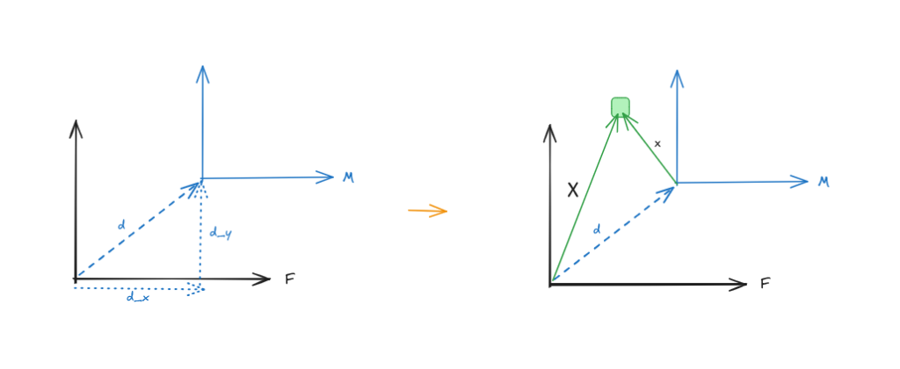
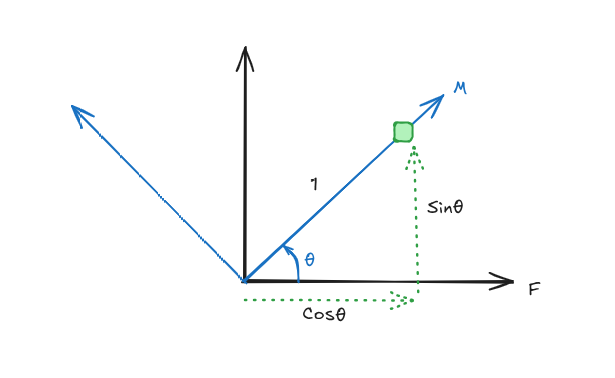
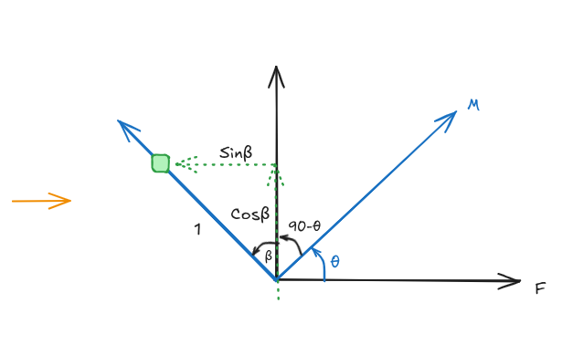
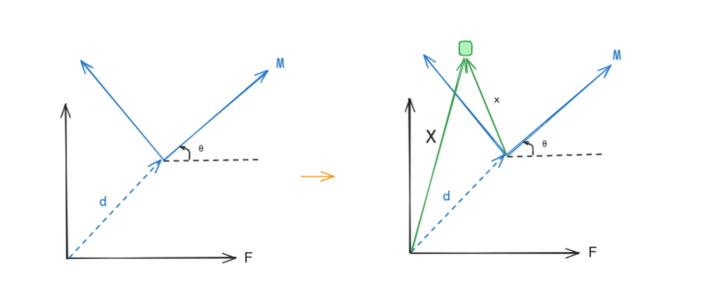
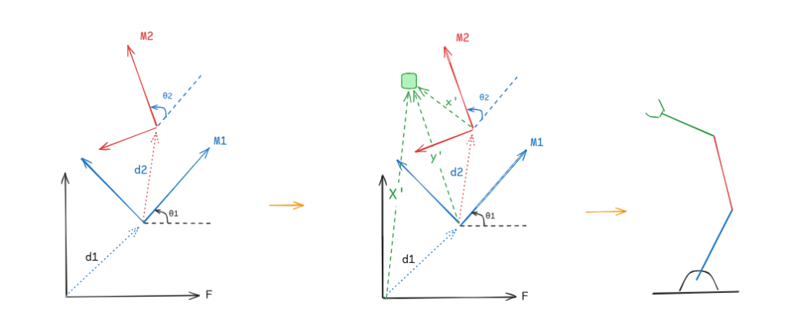



We all know robots to be physical, moving motors here, actuating servos there, LEDs blinking, and wires everywhere. Engineers have so designed it that we don't see the underlying architecture. 
Over the last few weeks I've been building something pretty cool, amazing infact, its going to blow your mind. Behold, my creation:

{{< carousel images="{image1.png,image2.png,image3.png}" captions="{image1.png:Wait; what's this? It looks confusing,image2.png:A bit better but I still don't get it.,image3.png:Okay; it makes a bit more sense now}" >}}

Okay, I know you were expecting something better. I've just shown you what a robot looks like on a computer. ROS2 provides a visualisation environment called RViz and the RGB-xyz coordinates are called **Transform Frames** (TF for short). These frames are used to perform certain calculations that results in movement & actuation, and thats what we would be exploring in this episode but lets lay a little foundation first. 

### Links & Joints
This sounds simple already, take your arm as an example. Your ulna & radius, tibia & fibula, femur, humerus, scapula, clavicle, carpals, metacarpals, phalanx.......sorry, i've gone overboard. I really loved biology. Back to robotics, your elbow is a joint and your ulna/Radius are links to your wrist. There are different types of joints: revolute, prismatic, continuous, and fixed. 

### Fixed & Moving Frame
A robo-arm doesn't float in the air, no matter how many parts are moving there must always be a fixed point, we define it as `base_link` in ROS. Moving frames are any links/joints that rotates or translates with respect to the fixed frame.

Your scapula is the fixed frame and the rest of your arm moves wrt it. Though your elbow is also a joint, its overall position is wrt your clavicle/scapula. Assume your arm is a robotic one, moving it forward and back takes actual calculations, matrices & vectors to be exact.

This is done using a series mathematical and mechanical techniques. Just to name a few: Coordinate transform, Forward kinematics, and Inverse Kinematics. I was surprised to find real robotics applications of MCE 201/202/341... it wasn't a waste. When a robotic arm moves, that motion can be represented by a transformation matrix \\(T\\). In coordinate transform, there are 3 instances of movement:
1. Pure Translation (xyz)
2. Pure Rotation
3. Rotation + Translation

Where:
$$\bar{X} = T \bar{x}$$

\\(\bar{X}\\) is the position of the fixed frame and \\(\bar{x}\\) is the position of the moving frame. To avoid complications we would be sticking to 2D systems in this post.

In pure translation, the moving frame only moves away from the origin of the fixed frame by x-y coordinates. Take for example a moving frame M translates from the fixed frame F by \\((d_x, d_y)\\) which can be represented with \\(\bar{d}\\) using pythagoras theorem.

We can easily obtain the position of the point wrt \\(\bar{X}\\) by adding the translation vectors:
$$\bar{X} = \bar{x} + \bar{d}$$

In pure rotation, you guessed it. The moving frame only rotates and a certain angle wrt the fixed frame. A slight caveat here is that clockwise motion here is taken as negative motion while counterclockwise motion is taken as positive.

  

    
  

  

    
Notice that:

    <ul>
      <li>$$M = \begin{bmatrix} 1 \\ 0 \end{bmatrix}$$</li>
      <li>$$F = \begin{bmatrix} \cos\theta \\ \sin\theta \end{bmatrix}$$</li>
    </ul>
  

Where vectors M and F are the position vectors of the point wrt the moving and fixed frames. In pure rotation \\(\bar{X} = R \bar{x}\\), where \\(R\\) is the rotation matrix. 
Let:
$$R = \begin{bmatrix} a & b \\\\ c & d \end{bmatrix}$$

In other words, the position vector of the point wrt the fixed frame F equals to the Rotation matrix multiplied by the position vector of the point wrt the moving frame M. \\(F = R M\\)

$$\bar{X} = \begin{bmatrix} a & b \\\\ c & d \end{bmatrix} \begin{bmatrix} 1 \\\\ 0 \end{bmatrix} = F$$
$$\begin{bmatrix} a \\\\ c \end{bmatrix} = \begin{bmatrix} \cos\theta \\\\ \sin\theta \end{bmatrix}$$
Hence \\(a = \cos\theta\\) and \\(c = \sin\theta\\).

Also, take another position.

  

    
  

  

    
Notice that:

    <ul>
      <li>$$M = \begin{bmatrix} 0 \\ 1 \end{bmatrix}$$</li>
      <li>$$F = \begin{bmatrix} -\sin\theta \\ \cos\theta \end{bmatrix}$$</li>
    </ul>
  

$$\bar{X} = \begin{bmatrix} a & b \\\\ c & d \end{bmatrix} \begin{bmatrix} 0 \\\\ 1 \end{bmatrix} = F$$
$$\begin{bmatrix} b \\\\ d \end{bmatrix} = \begin{bmatrix} -\sin\theta \\\\ \cos\theta \end{bmatrix}$$
\\(b = -\sin\theta\\) and \\(d = \cos\theta\\)

Therefore the rotation matrix:
$$R = \begin{bmatrix} a & b \\\\ c & d \end{bmatrix} = \begin{bmatrix} \cos\theta & -\sin\theta \\\\ \sin\theta & \cos\theta \end{bmatrix}$$

With this we can compute the position vector of any point within the 360 degree range wrt the fixed frame.

And finally, rotation + translation. 
This happens when the moving frame both translates from the fixed frame by \\(\bar{d}\\) and rotates by \\(\theta\\). 

\\(\bar{X}\\) is going to be a combination of both rotation and translation. It's simply given by:
$$\bar{X} = R \bar{x} + \bar{d}$$

$$\bar{X} = \begin{bmatrix} \cos\theta & -\sin\theta \\\\ \sin\theta & \cos\theta \end{bmatrix} \begin{bmatrix} x_x \\\\ x_y \end{bmatrix} + \begin{bmatrix} d_x \\\\ d_y \end{bmatrix}$$

Let's take \\(\theta = 45^\circ\\), \\(\bar{x} = \begin{bmatrix} 2 \\\\ 4 \end{bmatrix}\\) and \\(\bar{d} = \begin{bmatrix} 2 \\\\ 2 \end{bmatrix}\\):
$$\bar{X} = \begin{bmatrix} \cos 45^\circ & -\sin 45^\circ \\\\ \sin 45^\circ & \cos 45^\circ \end{bmatrix} \begin{bmatrix} 2 \\\\ 4 \end{bmatrix} + \begin{bmatrix} 2 \\\\ 2 \end{bmatrix}$$
$$= \begin{bmatrix} \frac{1}{2} & -\frac{1}{2} \\\\ \frac{1}{2} & \frac{1}{2} \end{bmatrix} \begin{bmatrix} 2 \\\\ 4 \end{bmatrix} + \begin{bmatrix} 2 \\\\ 2 \end{bmatrix}$$
$$= \begin{bmatrix} 1 & -2 \\\\ 1 & 2 \end{bmatrix} + \begin{bmatrix} 2 \\\\ 2 \end{bmatrix}$$

Since the matrices aren't the same size it's impossible to add them to obtain a single matrix. However, if \\(\theta = 90^\circ\\) the rotation matrix would resolve into a simple column matrix which can further be added to \\(\bar{d}\\) and then obtain a single matrix. With \\(\bar{d}\\) and \\(R\\) we can compute the transformation coordinates wrt the fixed frame of any point from the moving frame. 

In real life robotics, for instance a robotic arm, we have multiple moving frames connected to a fixed frame (`base_link`). Using your arm once again as an example, the scapula can be treated as part of the fixed base, providing the structural connection to the shoulder (glenohumeral) joint, which acts as moving frame 1. The humerus is link 1, connecting the shoulder to the elbow joint (moving frame 2). From there, the ulna and radius form the forearm, which we can treat as link 2, connecting the elbow to the wrist, which in this simplified model acts as the end-effector.

* \\(\bar{x}\\) is the position vector of the point wrt the moving frame M2. 
* \\(\bar{y}\\) is the position vector of the point wrt the moving frame M1.
* \\(\bar{X}\\) is the position vector of that same point wrt the fixed frame F.

Notice that \\(M_2\\) translates by \\(\bar{d}_2\\) and rotates by \\(\theta_2^\circ\\) from \\(M_1\\), and \\(M_1\\) translates by \\(\bar{d}_1\\) and rotates by \\(\theta_1^\circ\\) from F.

$$\bar{y} = R_2 \bar{x} + \bar{d}_2 \quad \text{and} \quad \bar{X} = R_1 \bar{y} + \bar{d}_1$$

Substituting \\(\bar{y}\\):
$$\bar{X} = R_1 (R_2 \bar{x} + \bar{d}_2) + \bar{d}_1$$
$$\bar{X} = R_1 R_2 \bar{x} + R_1 \bar{d}_2 + \bar{d}_1$$

Where \\(R_1 R_2 \bar{x}\\) is the rotation from both moving frames, and \\(R_1 \bar{d}_2 + \bar{d}_1\\) is the relative translation of moving frame M2 wrt F.

We can also compute the total rotation wrt the fixed frame by multiplying both rotation matrices:
$$R_1 R_2 = \begin{bmatrix} \cos(\theta_1 + \theta_2) & -\sin(\theta_1 + \theta_2) \\\\ \sin(\theta_1 + \theta_2) & \cos(\theta_1 + \theta_2) \end{bmatrix}$$

Remember I said \\(\bar{X} = T \bar{x}\\)? 
Here is how we obtain T: we combine the rotation matrix and translation vectors. However, R is a 2x2 matrix while \\(\bar{d}\\) is a 2x1 vector... mathematically impossible. To combine them, we plug in `[0 0 1]` to the bottom of R and `[1]` to the bottom of \\(\bar{d}\\):
$$T = \begin{bmatrix} \cos\theta & -\sin\theta & a \\\\ \sin\theta & \cos\theta & b \\\\ 0 & 0 & 1 \end{bmatrix}$$
$$\bar{X} = \begin{bmatrix} X \\\\ Y \\\\ 1 \end{bmatrix} = \begin{bmatrix} \cos\theta & -\sin\theta & a \\\\ \sin\theta & \cos\theta & b \\\\ 0 & 0 & 1 \end{bmatrix} \begin{bmatrix} x \\\\ y \\\\ 1 \end{bmatrix}$$

To wrap it all up, having matrix T allows us to easily find the position vectors of any point in 2D which has translated, rotated, or both. ROS does all these calculations in the background 30-100 times a second and publishes the data to the odometry node. That's in 3D, and because you cannot multiply a 3D rotation matrix by a 3D translation vector directly, ROS 2 relies on a \\(4 \times 4\\) Homogeneous Transformation Matrix to calculate all spatial relationships. This was just 2D. 🥲
