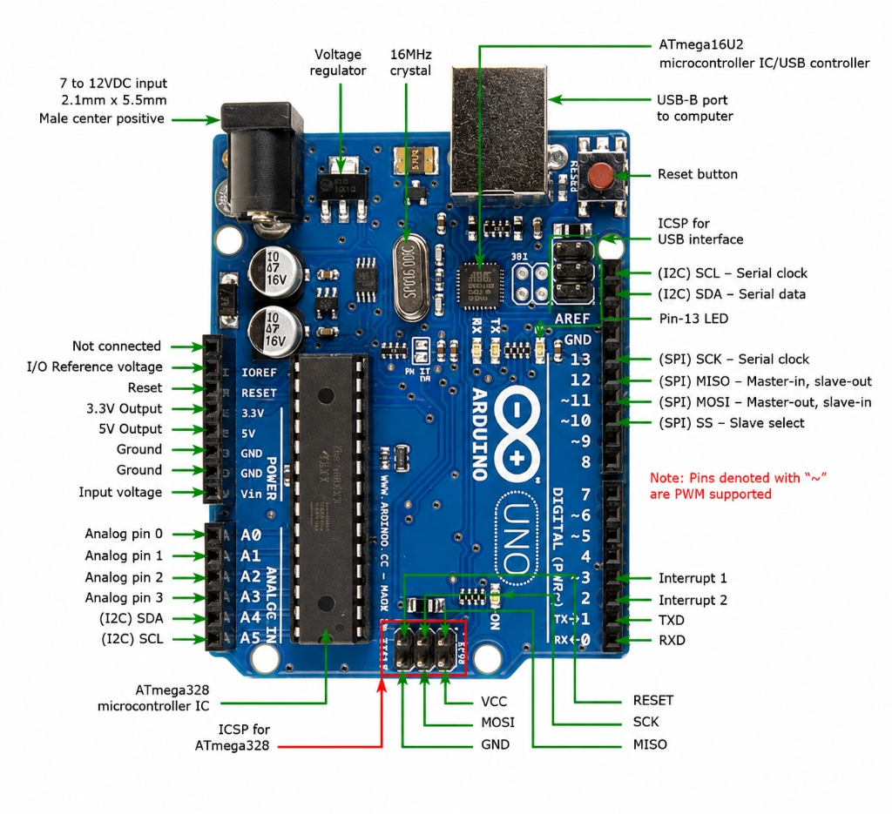

Arduino is an open-source electronics platform that combines programmable microcontroller boards with an easy-to-use software environment. It is widely used for building embedded systems, robotics, Internet of Things (IoT) devices, automation systems, and educational projects due to its affordability, simplicity, and large community support.

Arduino is available in several variants, each designed for different applications. Popular boards include the **Arduino Uno** for general-purpose prototyping, the **Arduino Nano** for compact projects, the **Arduino Mega 2560** for applications requiring more memory and I/O pins, and the **Arduino Leonardo**, capable of emulating USB devices such as keyboards and mice. More advanced boards, including the Arduino Due, Nano 33 IoT, Nano ESP32, and Portenta series, for higher-performance processing. 

These boards are programmed using the **Arduino IDE**, where developers write sketches in **C++**, using the Arduino Integrated Development Environment (IDE), a lightweight development environment available for Windows, macOS, and Linux. The Arduino IDE allows users to write programs, known as sketches, in a simplified version of C++, compile them into machine code, and upload them directly to the microcontroller through a USB connection. The platform abstracts much of the underlying hardware complexity by providing a rich collection of built-in libraries and functions, enabling developers to interface with sensors, actuators, communication modules, and displays using only a few lines of code. This balance between simplicity and capability has made Arduino the preferred starting point for embedded systems development and rapid hardware prototyping.

The most common type is the Arduino Uno, so I'd be doing a breakdown on that. 

This is the style I'd go for—still technically accurate, but it feels like someone explaining the board in a lab instead of reading a datasheet.

---

# The Processing Core

### **ATmega328 Microcontroller**

This is the actual brain of the Arduino Uno. Every line of C++ you write ends up here. It's not exactly a supercomputer though—it has just **32KB of storage** for your program and a tiny **2KB of RAM** for variables. That's less memory than a single modern photo, yet people have built robots, drones, and even games with it. Respect the little guy.

### **16MHz Crystal Oscillator**

Think of this as the Arduino's heartbeat. It ticks **16 million times every second**, telling the processor when to do its next job. Every `delay(1000)` you write is basically telling your Arduino, *"Just stand there and stare into space for a second."* It obeys... because that's what good microcontrollers do.

### **ATmega16U2 USB Controller**

Your laptop speaks USB. The ATmega328 doesn't—it only understands Serial communication. This second chip works as a translator, converting USB from your computer into something the main processor understands. Without it, uploading code would be a very awkward conversation.

---

# Power Delivery

### **Barrel Jack (7V–12V)**

This is where you plug in an external power supply when your Arduino isn't living off your laptop's USB port.

### **Voltage Regulator**

The board only likes **5V**, so if you feed it 9V or 12V, the regulator politely throws away the extra voltage... by turning it into **heat**. Feed it too much power while running motors and it'll basically say, *"I'm too hot for this,"* and shut itself down.

### **Vin Pin**

This is directly connected to your external power input. It's handy if you need that raw battery voltage for things like motor drivers.

### **5V & 3.3V Pins**

These provide regulated power for sensors and small modules. They're **not** meant for motors. If you try powering a DC motor from the 5V pin, the Arduino's last words may be, *"I trusted you."*

---

# The I/O Pins

### **Digital Pins (0–13)**

These pins only know two words: **HIGH** and **LOW** (5V or 0V). They're great for LEDs, buttons, and sensors, but each pin can safely provide only about **20mA**. Anything bigger needs a transistor or relay.

### **PWM Pins (~)**

PWM stands for **Pulse Width Modulation**. The Arduino isn't producing a true analog voltage—it just switches between ON and OFF so quickly that devices like LEDs and motors think they're getting less power. It's basically the Arduino's version of *fake it till you make it*.

### **Analog Pins (A0–A5)**

Unlike digital pins, these can measure voltages between **0V and 5V**. The Arduino converts that voltage into a number between **0 and 1023**, giving your code something it can actually understand.

## **Interrupt pins (2 and 3)** 

Allows the Arduino to pause its current task and immediately respond to important events, such as a button press or sensor trigger, before returning to where it left off. Unlike regular pins that must be checked repeatedly in `loop()`, interrupt pins notify the processor the moment a change occurs, making them ideal for time-critical applications like emergency stop buttons, rotary encoders, and pulse counting.

### **AREF**

Normally the Arduino measures voltages relative to 5V. AREF lets you change that reference. For example, if your sensor only outputs up to 3.3V, using AREF makes your readings much more accurate instead of wasting part of the measurement range.

### **IOREF**

This simply tells shields what voltage the Arduino is using (5V on the Uno). Think of it as the board introducing itself before everyone starts talking.

---

# Communication

### **TX & RX**

These are the Serial communication pins. They're also connected to the USB chip, which means plugging another Serial device into them while uploading code is like having two people yell at the Arduino at the same time. It gets confused.

### **I²C (SDA & SCL)**

A communication system that lets many devices share just **two wires**. On the Uno, these are actually the same physical pins as **A4** and **A5**.

### **SPI**

SPI is the Arduino's "fast lane" for communication. Devices like SD card modules and some displays use it because it's much quicker than I²C.

---

# Low-Level Control

### **Reset Button**

Pressing Reset doesn't erase your program—it simply restarts it from the beginning. Think of it as turning your robot off and back on without unplugging it.

### **ICSP Headers**

These are the Arduino's backstage entrance. They're used for programming the chips directly, restoring bootloaders, or even turning the Arduino into a USB keyboard or mouse if you're feeling adventurous.

---

The Arduino Uno may look simple, but every component has a specific job. Once you understand what each part does, the board stops looking like a collection of random chips and starts looking like a tiny, well-organized computer.
