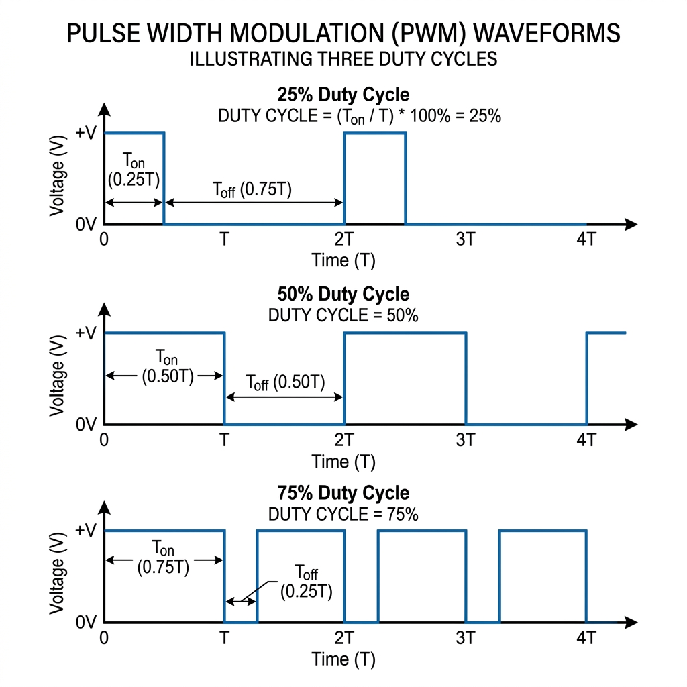



Pulse Width Modulation has personally burgled me in the past, even ChatGPT wasn't doing justice to the topic for me. However, PWM is used everywhere in modern electronics all because of a problem digital systems came along with. 

Last semester, I took a very interesting and well understandable course (kindly swap those words with antonyms) called Signals and Systems... MTE 306. The early stages of the course discussed what digital and analog systems were. To really understand PWM, you need to digest this concept and understand how Digital systems work. Let's do a quick definition. 

> **Analog signals** are continuous in both time and amplitude. This means that their values can take any possible magnitude within a given range. **Digital signals**, in contrast, are discrete in both time and amplitude. Their values are limited to specific levels, e.g., binary.

Digital signals are basically 1s and 0s, ON or OFF, true or false, no in-between. This is the problem I mentioned earlier. Have you ever wondered how your phone is able to reduce its brightness, or how your laptop increases and decreases the intensity of its cooling fan? Let's make it a bit mechatronic: how does your Arduino reduce your motor speed, or how does a flight controller control the speed of the propellers using the ESC? Knowing fully well these systems are digital systems... 0s and 1s. It's all PWM!

Analog systems can increase or decrease in value, such as using a potentiometer to control speed. Let me just do a crash course on how potentiometers work. A potentiometer is basically a three‑terminal variable resistor that can act as a voltage divider. When connected between a supply voltage (e.g., 5V) and ground, its wiper output produces an analog voltage proportional to its rotation position. A variable resistor, in simple words. This voltage can range from 0V to the supply voltage depending on the wiper setting. Digital systems can't do that... or do they? You'd be surprised how engineers solved this problem. One word.

**Duty Cycles.**

Okay, I know it's actually two words but who's counting. The concept of the duty cycle comes directly from telecommunications and clock signal engineering. In a modern microcontroller, the duty cycle is calculated, managed, and controlled entirely by dedicated hardware blocks called Hardware Timers/Counters working alongside specialized Compare Registers. From Arduino 101, I made mention of a 16MHz Crystal Oscillator which is basically the system clock. Using this system clock, Counter registers, and an output compare register, microcontrollers and digital systems can alter duty cycles. 

> A **Duty Cycle** is the percentage of time a signal is ON during one complete cycle.

Imagine a light switch on a wall. If you flip the switch ON, the bulb is at 100% brightness. If you flip it OFF, the bulb is at 0% brightness. If you could flip that switch ON and OFF 100 times every second, your eyes would not see the flashing. Instead, because the bulb is only on for half the time, your brain perceives it as a steady light at 50% brightness. So when we alter how fast a signal flips per cycle, we also change the average output voltage. 

From a mathematical perspective:
$$V_{\text{avg}} = V_{\text{high}} \times \text{Duty Cycle}(\\%) = V_{\text{high}} \times \frac{T_{\text{on}}}{T_{\text{on}} + T_{\text{off}}}$$

* **25% Duty Cycle (Quarter Power):** The signal is ON for 25% of the time and OFF for 75% of the time. 
  5V System: \\(5\text{V} \times 0.25 = \mathbf{1.25\text{V}}\\) average.
* **50% Duty Cycle (Half Power):** The signal is ON for 50% of the time and OFF for 50% of the time.  
  5V System: \\(5\text{V} \times 0.50 = \mathbf{2.5\text{V}}\\) average.
* **75% Duty Cycle (Three-Quarter Power):** The signal is ON for 75% of the time and OFF for 25% of the time.  
  5V System: \\(5\text{V} \times 0.75 = \mathbf{3.75\text{V}}\\) average.

The full concept of Duty Cycles in electronics is much deeper and genuinely intriguing, but it's out of scope for this particular topic so I won't be going any further.

 Nonetheless, the calculations above demonstrate how duty cycles increase and decrease the output voltage of a 5V system, e.g., an Arduino. This technique used to control the amount of power sent to an electronic device by turning the digital signal on and off incredibly fast is called **Pulse Width Modulation (PWM)**. To add a bit more context, notice that changing the duty cycle also changes the width of the pulses (waveforms) on the graph... hence the name. 

Besides being a solution to a digital problem, PWM also has advantages compared to analog potentiometer methods, such as torque maintenance and almost zero heat losses. This has been PWM in 5 minutes, hope this helps.
