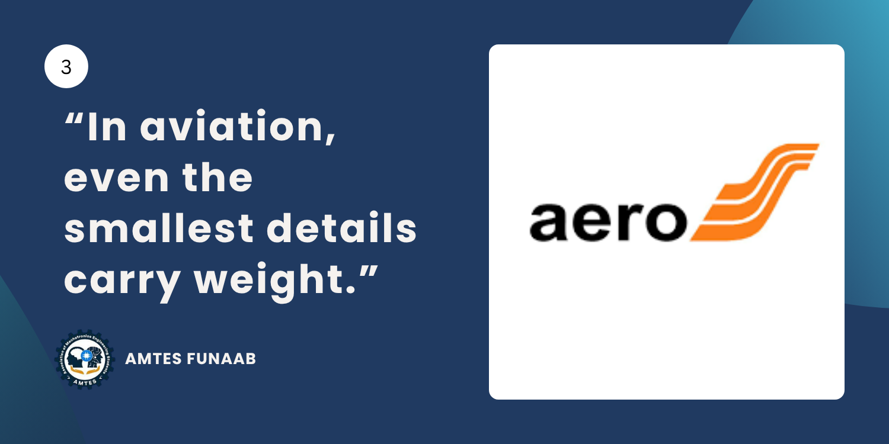
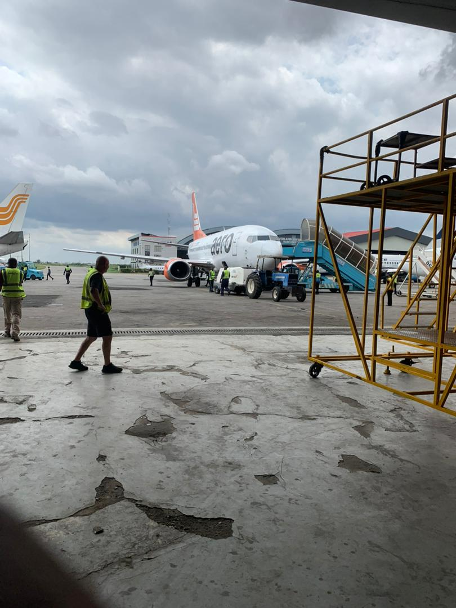
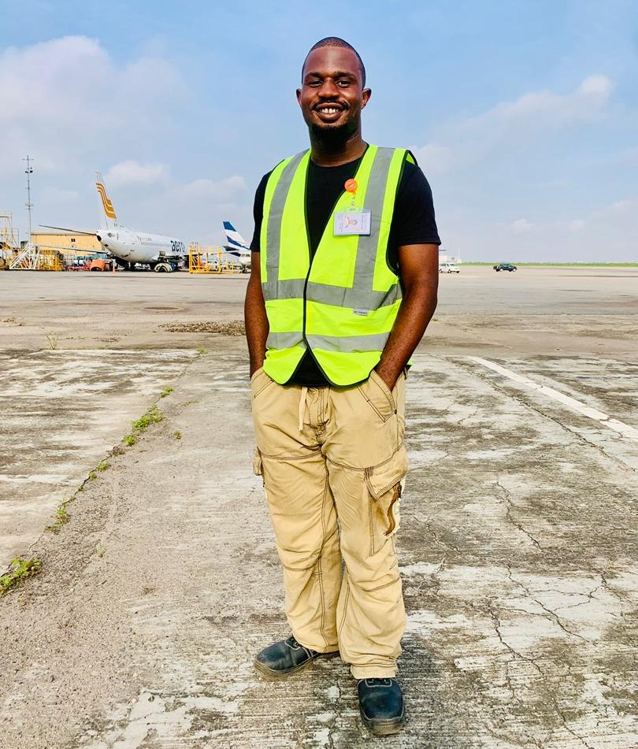
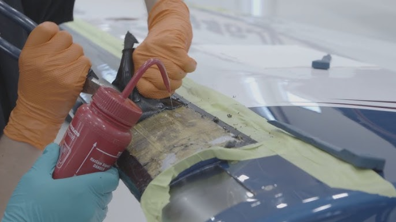
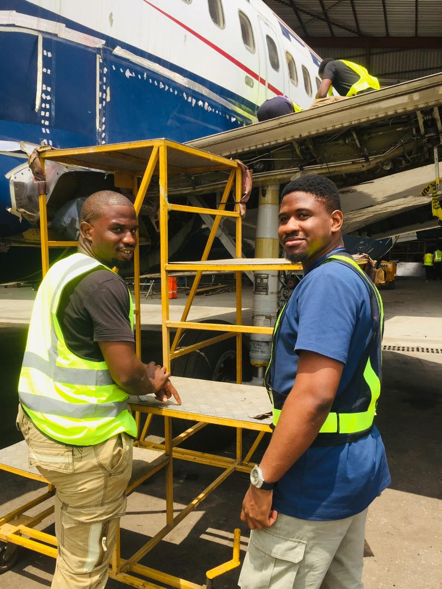
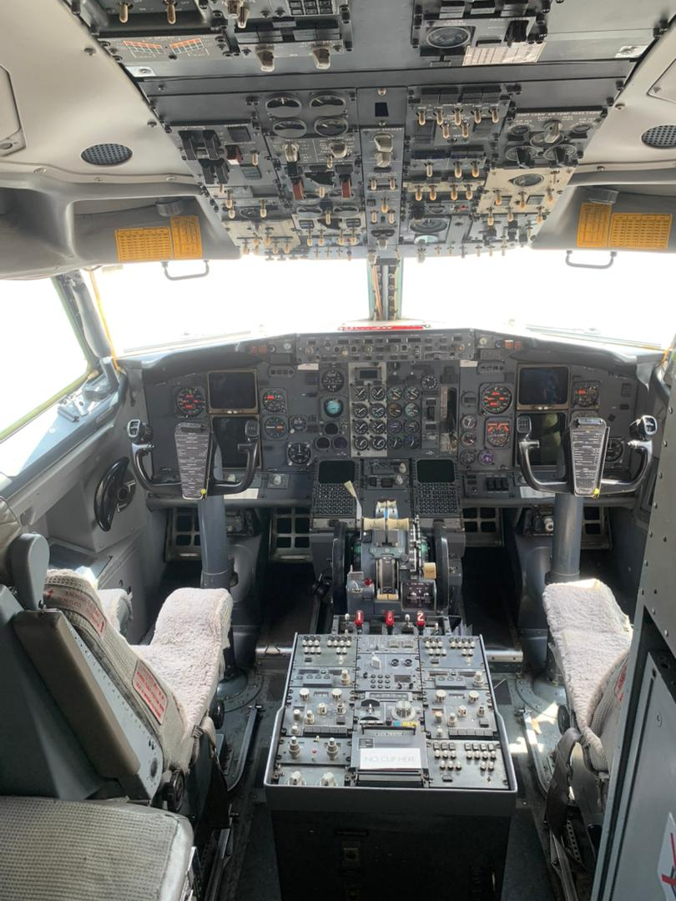
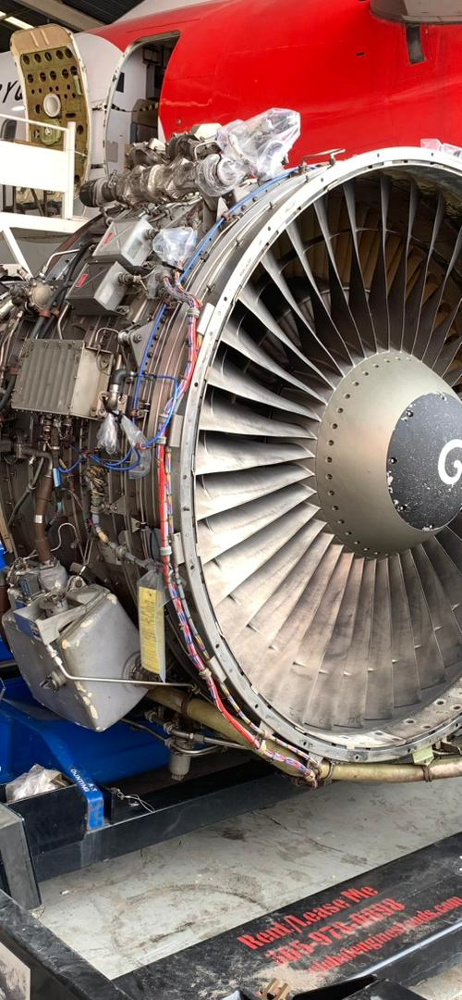
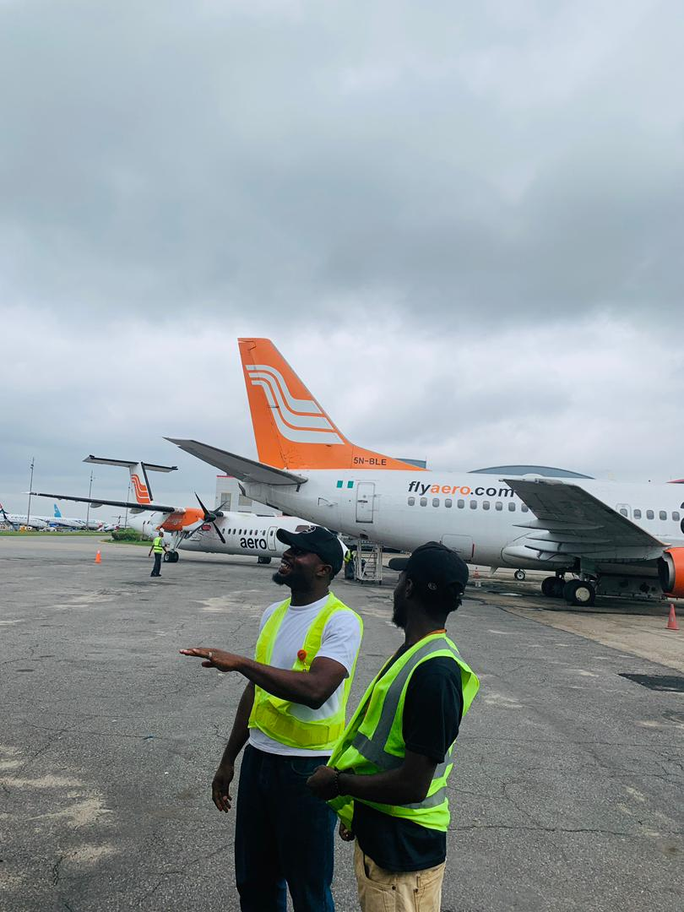

There’s a strange feeling that comes with being in the internship phase as a student, especially when it seems like everyone around you is moving faster than you are. One moment, you’re still caught up in assignments, classes, and school routines, and the next, conversations begin revolving around placements, applications, interviews, and resumption dates. Gradually, you start noticing that people are securing opportunities, updating their LinkedIn profiles, posting pictures in offices and workshops, and talking about their experiences while you remain stuck in the waiting phase, refreshing your inbox and hoping something eventually works out.

That period was emotionally confusing for me because, oddly enough, I didn’t feel the panic I expected myself to feel. Many people around me seemed visibly anxious about getting placements early, but I felt strangely calm, almost disconnected from the reality of what was happening. Looking back now, I think my biggest fear at the time wasn’t even the possibility of starting my internship late. It was the fact that I wasn’t worried enough. It felt as though I hadn’t fully processed how important that phase of my life was supposed to be.
My family, however, refused to let me remain idle during the waiting period. They constantly encouraged me to stay productive, explore other interests, take courses, and learn new things instead of sitting around obsessing over responses that might never come. I convinced myself that I was simply “finding answers” and using the time wisely, but beneath all of that was the reality that every passing day still felt like a countdown. No matter how calm you appear on the surface, there’s always that subtle pressure that comes with uncertainty, especially when you don’t yet know where you’ll spend the next several months of your life.

Eventually, after what felt like an endless cycle of applications, silence, and waiting, the call finally came. I had been asked to come in and pick up my ID card, and I remember the immediate relief that washed over me that day. For the first time in weeks, things finally started feeling tangible and real.
But just when I started settling into that excitement, I overheard a conversation about something called ODC. Thankfully, curiosity pushed me to ask questions instead of pretending I understood what everyone was talking about. That introduced me to another phase of waiting entirely. At first glance, ODC, which stood for On Duty Clearance, sounded like ordinary paperwork, but the more I learned about it, the more I realized it represented something much deeper than administrative procedure. It was a structured process of checks, confirmations, and approvals designed to ensure that every individual entering the work environment had been properly verified and cleared.

That became my first introduction to the culture of aviation. Nothing about the industry felt casual or improvised. Every process existed for a reason, and every stage seemed carefully designed to maintain structure, accountability, and safety. Even before officially resuming, I was already beginning to understand that aviation was an environment built on discipline and precision. At that point, however, I still felt like someone standing outside its atmosphere, waiting patiently for permission to enter.

## My First Days at “Mars”

When I finally resumed, it didn’t take long for me to realize that aviation has a way of humbling you very quickly. Ironically, one of my earliest lessons began with something as simple as a reflective jacket. At first, it felt like just another piece of PPE handed out as part of standard workplace procedure, something ordinary that didn’t seem particularly important. But aviation teaches you very quickly that nothing within its systems exists without purpose. Every item, every process, and every precaution carries meaning, even when you don’t fully understand it yet.

My supposed first day didn’t exactly go according to plan either. A thirty-minute detour was enough for me to completely miss my supervisor. By the time I arrived, he had already traveled to Kano because of an emergency. At first, I genuinely believed things would somehow still work out. I sat outside his office for hours, hopeful that maybe plans would suddenly change or that someone would tell me he was still around somewhere. I waited long enough to complete a Coursera certificate while sitting there, trying to make the most of the situation. Eventually, I approached the secretary for an update, only to hear that he had left over an hour earlier and wouldn’t be returning until the following week.

At the time, the experience felt deeply frustrating. After all the uncertainty leading up to the internship itself, having my first day collapse felt unfair. But looking back now, I think that moment taught me something important very early on: aviation does not bend itself around your convenience. It has its own systems, its own timing, and its own rhythm. You either learn to adapt to it or spend your time struggling against structures that were never designed to adjust around you.

Interestingly enough, my actual “real” first day only happened after I received a call informing me that I had already been marked absent for days I assumed didn’t count. That immediately changed my mindset because suddenly, this was no longer an abstract experience I was preparing for mentally. It was real, and I was now fully responsible for showing up properly within the system.
Before resuming, I thought that I would most likely be placed in avionics because of my mechatronics background. It seemed like the most natural fit for my interests and academic experience. Instead, I was assigned to Structural Maintenance, specifically Sheet Metal. At the time, I honestly didn’t understand why. If anything, I was slightly confused by the placement initially because it wasn’t what I imagined for myself. But one thing life has a way of teaching repeatedly is that growth often comes from spaces you never would have chosen for yourself. Looking back now, I think that placement gave me exactly the perspective I needed.

The first week was short, but mentally intense. Most of my time was spent trying to absorb everything around me quickly enough to avoid looking completely lost. Within just a few days, I found myself memorizing tool names simply so I wouldn’t freeze if someone suddenly asked me to retrieve one. Gradually, I started learning the language of aviation; the abbreviations, the hand signals, the communication patterns, and the unspoken expectations that everyone around me somehow seemed to understand instinctively.
Everything about the environment felt unfamiliar at first. The commute, the early resumption hours, the structured timing of activities, and even the atmosphere itself all carried a level of discipline that I wasn’t used to. One thing that fascinated me almost immediately was the security system within the environment. There was intentionality built into everything around me, and gradually, I started understanding why aviation is regarded as one of the safest industries in the world. Nothing felt careless. Nothing felt random.

One of the first systems that genuinely captured my attention was the deicing boot. 

*Image source: [Youtube](https://www.youtube.com/watch?v=z5IIcwzy_34)*

Initially, it seemed relatively straightforward, but the deeper I went into understanding how it functioned, how leak testing worked, and how replacements were carried out, the more I started appreciating the level of engineering hidden behind components most passengers would never even notice during a flight. That realization stayed with me throughout the internship because it highlighted something fundamental about aviation: the smallest details often carry enormous responsibility. Every process, every inspection, and every component exists because somebody, somewhere, once understood the consequences of neglecting it.

## The Experience That Changed Everything

Not too long afterwards, I was given my first hands-on task. Under close supervision, I was allowed to fabricate a strip that would be used in fixing a cargo door. To someone outside the field, that task might sound relatively insignificant, but for me, it represented something much bigger than the work itself. For the first time, I wasn’t simply observing maintenance activities from a distance anymore. I was participating in them, however small my contribution might have been.

That changed something for me because the aircraft stopped feeling like this distant, untouchable machine and started feeling like something I could genuinely interact with and understand. Up until then, much of my experience had involved observation, learning, and trying to make sense of systems from the outside. But contributing, even in a small supervised way, made the environment feel less intimidating and more real. That was probably the first moment “Mars” started feeling slightly less distant to me.
The true turning point of my internship, however, came during the C-checks. That period completely transformed the way I saw aircraft maintenance and engineering as a whole. Before then, most of my learning had happened in fragments. I understood systems individually, learned procedures separately, and absorbed information in isolated pieces. The C-check brought everything together in a way that suddenly made the aircraft feel whole.

I still remember hearing the words, “Let’s open up the cargo door,” and somehow, from that moment onward, I started seeing the aircraft differently. It stopped looking like a collection of separate systems and started revealing itself as an interconnected structure where every component depended on another with extraordinary precision. We worked through different sections of the aircraft, including the wheel well, the cargo bay, the wing tips, and the deicing systems, which I had previously only understood from a surface level.

Gradually, you begin noticing something remarkable about aircraft engineering: the complexity is never unnecessary. Every single detail carries purpose behind it. That realization stayed with me constantly during the C-checks, especially while observing the B737. The aircraft felt like a masterpiece of engineering, not because it tried to appear impressive in an obvious way, but because every rivet, every reinforcement pattern, and every access panel reflected careful decisions balancing safety, accessibility, efficiency, and structural integrity.

But as incredible as the aircraft itself was, I think the people around me shaped my experience even more. What stood out most was how intentional the engineers were about involving interns in the learning process. Even when tasks were assigned based on complexity, they still found ways to explain things to us, answer questions, and ensure we understood not only what was happening but why it mattered. Somewhere along the line, the internship stopped feeling like ordinary maintenance exposure and started feeling like an education in mindset.

## Things I enjoyed about working at Chevron

Looking back now, I think one of the most valuable parts of the internship wasn’t even the technical exposure itself, but the mindset shifts that happened along the way. Long before this experience, aviation was simply an industry I admired from a distance. I appreciated the engineering behind aircraft and found the systems fascinating, but spending months inside that environment changed the way I understood responsibility, structure, and even learning itself.

The internship constantly reminded me that aviation is an industry where small oversights can carry enormous consequences, which is why precision is treated almost like a culture rather than a skill. Over time, I started noticing that many of the lessons I was learning inside the hangar applied far beyond aircraft maintenance.

Here are some of the things the experience taught me:

### 1. Every small detail matters more than you think

One of the biggest mindset shifts I experienced came from realizing how much attention aviation gives to details most people would never even notice. Before the internship, it was easy to assume that certain components or procedures were minor, especially when viewed from the outside. But spending time around inspections, maintenance procedures, and system checks made it clear that aviation safety is built on thousands of small decisions being handled correctly every single time.

Watching engineers work taught me that precision isn’t about perfection for appearance’s sake. It’s about understanding that tiny oversights can eventually become major problems if ignored.

### 2. Discipline is what keeps complex systems functioning

Before entering the industry, many workplace routines simply looked strict from the outside. Early resumption hours, structured processes, clearance systems, documentation procedures, and communication protocols all seemed excessive until I started understanding the environment more deeply.

Gradually, I realized that aviation depends heavily on discipline because there is very little room for assumptions. Systems function properly because people consistently follow procedures, not because they “feel experienced enough” to skip them. That level of structure changed the way I think about responsibility and professionalism generally.

### 3. You learn faster when you ask questions

One thing I appreciated throughout the internship was how willing many of the engineers were to explain concepts whenever curiosity was shown. Some of the most valuable lessons I gained came from moments where I simply asked, “Why is this done this way?” instead of quietly observing.

I learned very quickly that growth doesn’t happen automatically just because you occupy a space. Two people can stand in the same hangar every day and leave with completely different experiences depending on how intentional they are about learning.

### 4. Engineering is more beautiful when you understand the “why” behind it

The C-checks especially changed the way I viewed aircraft engineering. Before then, many systems felt isolated in my mind, but seeing the aircraft opened up section by section helped me understand how interconnected everything truly was.

What fascinated me most wasn’t even the complexity itself, but the intentionality behind the design decisions. Every rivet placement, reinforcement pattern, access panel, and structural layout reflected careful engineering tradeoffs involving safety, accessibility, efficiency, and reliability.

It made me appreciate engineering not just as technical work but as thoughtful problem-solving on a very large scale.

### 5. Growth sometimes comes from the places you didn’t plan for
Going into the internship, I assumed I would most likely end up in avionics because of my mechatronics background. Being assigned to Structural Maintenance initially confused me because it wasn’t what I had pictured for myself.

But looking back now, I honestly think that placement gave me perspectives I might never have gained otherwise. It reminded me that sometimes the experiences that shape you most are the ones you didn’t originally choose.

## The Moments I’ll Always Remember

Interestingly enough, some of my favorite memories from the internship had very little to do with the technical work itself. As intense and educational as the maintenance activities were, many of the moments that stayed with me the most happened in the quieter spaces between the work.

### 1. My first hands-on contribution to an aircraft
Being allowed to fabricate a strip for a cargo door under supervision might sound like a very small task from the outside, but I remember how significant it felt internally.
That was the first moment the aircraft stopped feeling distant and untouchable to me. Up until then, I had mostly been observing and trying to understand things conceptually. Contributing, even in a controlled and supervised way, made the environment feel real in a completely different way.

### 2. The first time the aircraft was opened up during the C-check
I don’t think I’ll ever forget the shift in perspective that happened during that phase. Watching panels open, systems become visible, and different sections of the aircraft reveal themselves gradually changed the way I saw aviation engineering entirely.
The aircraft stopped looking like a single object and started feeling like a carefully interconnected ecosystem of systems, structures, and engineering decisions.
That experience genuinely deepened my appreciation for the level of thought behind aircraft design.

### 3. The suya gatherings after long workdays
Some of the most human moments happened after work itself. The conversations, laughter, storytelling, and small celebrations inside the workshop created an atmosphere that balanced out the intensity of the environment beautifully.
Those moments reminded me that, beyond all the precision, procedures, and discipline, there were still people building relationships while doing meaningful work together.

### 4. Watching the test flights
There was always something emotional about watching an aircraft take off after maintenance work had been completed. Everyone would pause to watch closely, and even though it happened repeatedly, it never really felt ordinary.

Maybe it was because the takeoff represented trust more than anything else. Trust that every inspection had been carried out correctly, trust that every component had been secured properly, and trust that the work done on the ground would hold safely in the air.

## Looking Back at “Mars”
By the end of the internship, Mars no longer felt distant. Not because the environment itself had changed, but because I had changed within it. What once felt overwhelming slowly became structured, and what once looked impossibly complex gradually revealed patterns, logic, and intention.

And if you still haven’t figured it out by now, Mars was never another planet.

It was [Aero Contractors Nigeria Limited](linkedin.com/company/aero-contractors-of-nigeria-ltd/?originalSubdomain=ng).

The hangars, the systems, the discipline, and the people all existed here, operating according to standards and expectations far bigger than any individual person. Looking back now, I realize the experience gave me much more than technical exposure. It changed the way I think about learning, responsibility, and growth itself.

I learned that showing up early is not simply about punctuality, but about respecting the systems you’re entering. I learned that asking questions often teaches you faster than silent observation ever will. Most importantly, I learned that growth does not happen automatically simply because you occupy a space. You have to intentionally seek understanding from every experience placed in front of you.

Mars taught me precision. It taught me patience. It taught me that the details nobody notices are often the ones carrying the greatest responsibility. And while I may still be far from where I ultimately hope to be, I know one thing for certain: I’m no longer standing outside the atmosphere wondering whether I belong there. I’ve already started learning how to breathe within it.

*Chidera Igbodike’s story shows how much growth can come from being open to learning and making the most of every opportunity. During his internship at Aero Contractors Nigeria Limited, he gained hands-on experience in aviation maintenance while also learning the importance of discipline, precision, teamwork, and paying attention to details. By staying curious, asking questions, and fully involving himself in the experience, he was able to learn far beyond the technical side of the internship.*

*His journey is a reminder that internships are not just about work experience, but also about growth, mindset, and discovering new possibilities for yourself.*

*From all of us at AMTES, we celebrate you!*

*You can connect with him on LinkedIn [here.](https://www.linkedin.com/in/chidera0igbodike/)*
