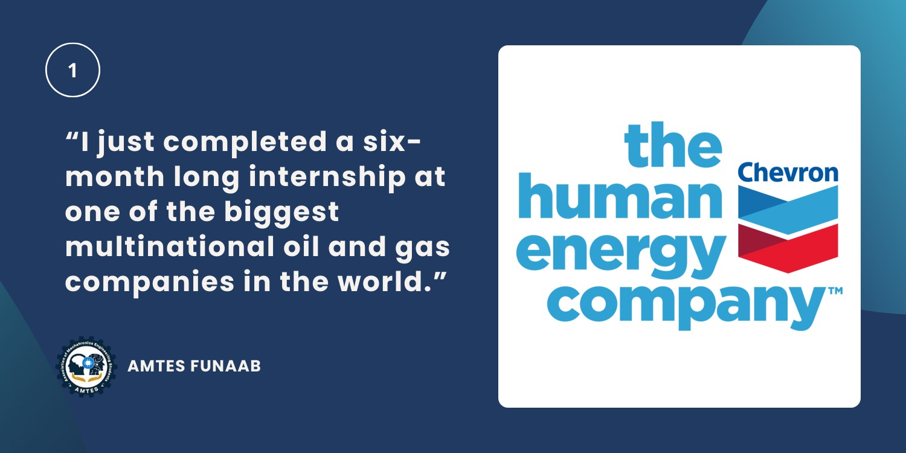
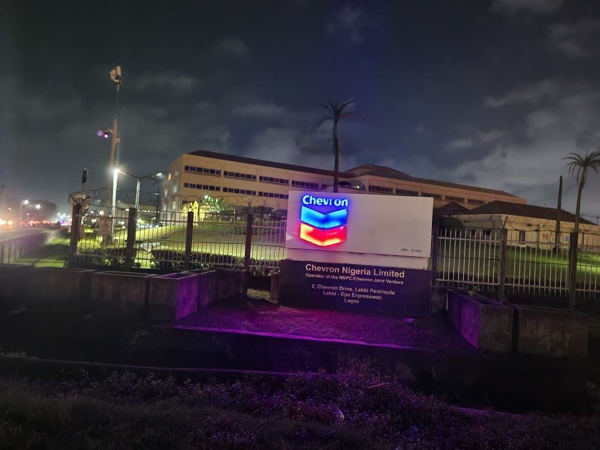
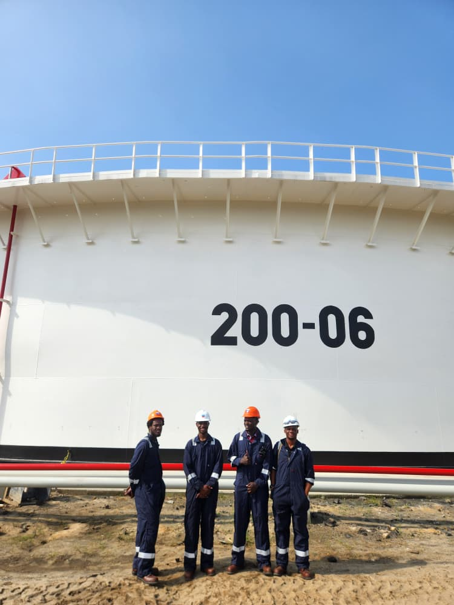
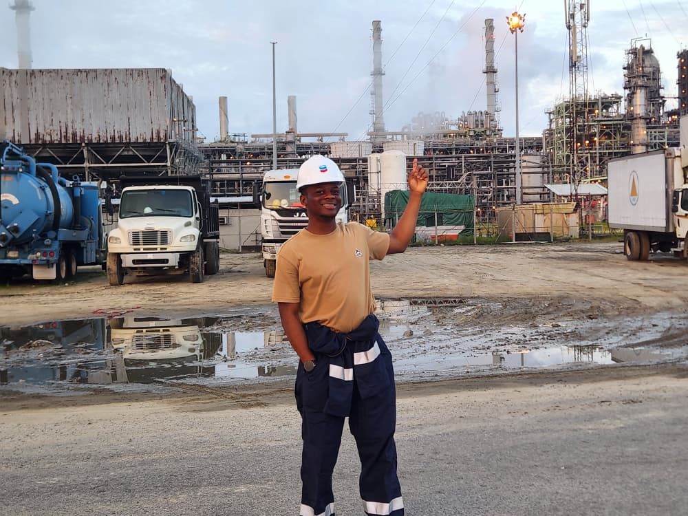
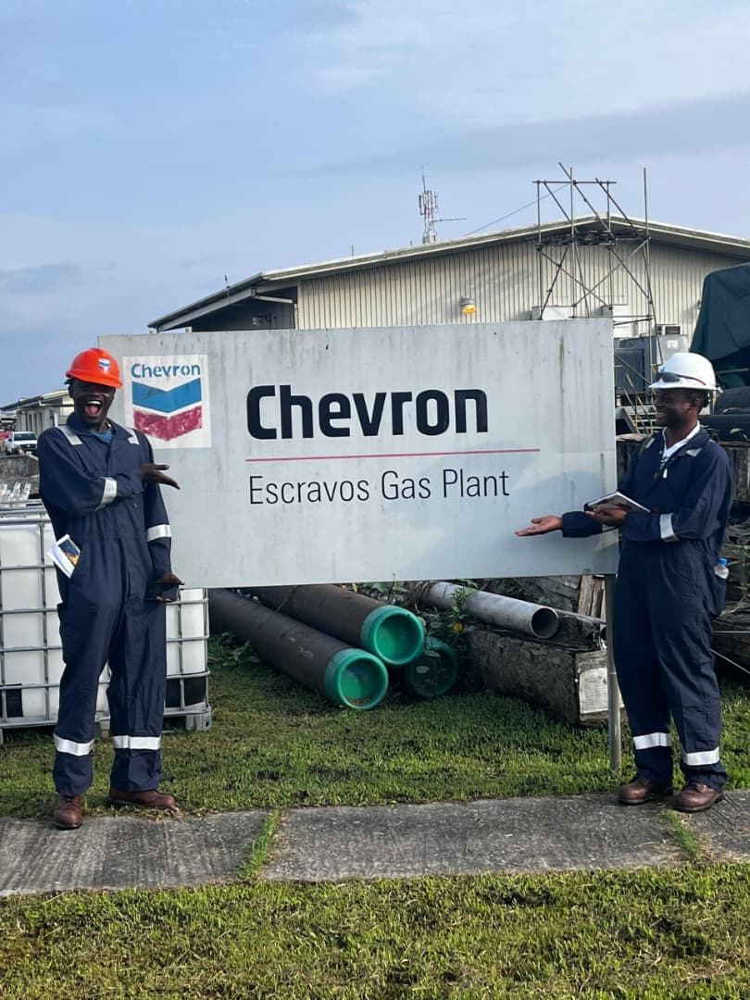
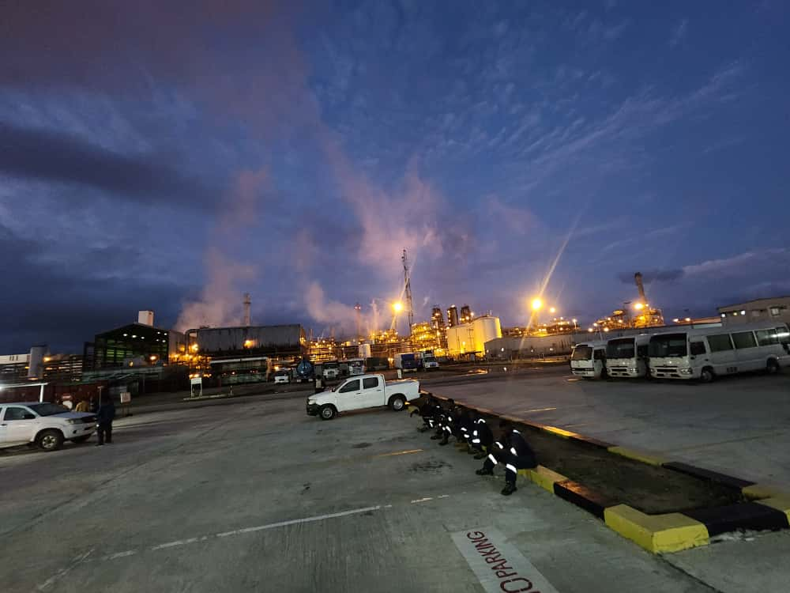

You know how there are seasons in your life when you’re so obsessed with your own plans that you become completely blind to whatever else life might be planning for you? That was exactly me.

I would say I had planned out most of what my life post-high school would be like, only to discover that life had its own plans; plans I never could have predicted.

I just completed a six-month-long internship at one of the biggest multinational oil and gas companies in the world. Here’s my story, but  before we go too deep into it, you should hold on to these very important points:

- Sometimes when things don’t turn out the way we want, it’s not because of incapabilities, but more about what life has in store for us.
- The grace of God is real, and it has a super-powerful influence on all we do.
- It’s what you believe in the most that you’re able to manifest with ease.

You’d understand how these apply where necessary.

## My Application to Chevron

If anyone had told me at any point that I would intern at a prestigious multinational like Chevron, I would have smirked and probably listed a hundred better ways I had imagined my journey unfolding. But as I mentioned earlier, sometimes we make plans, only to realize life has something entirely different to offer.

I remember telling my supervisors on my last day at work that my biggest motivation for applying to Chevron was simply that it was closest to a relative’s residence. I also recalled constantly passing by the company’s sign every time I commuted to my workplace during my SIWES I internship.

It was less than a fifteen-minute drive from where I lived.

Transporting to work would have made SIWES I really hectic for me, but thanks to the company’s provision for a transportation allowance, I was mostly covered. So, for my next internship placement, I knew it needed to be located somewhere close to my place of residence. That was basically what I focused on during my search for a placement for SIWES II.

I first learned about the application as early as November of the year before my internship, through my class’s official group. My HoC (Head of Class) had forwarded the application link.

I went through the requirements carefully and began preparing. I updated my resume, compiled the necessary academic information, and did a bit of research on the company, since I barely knew anything about the oil and gas industry at the time.

Once I felt ready, I submitted my application.

About one to three weeks later, I received an email inviting me to complete the entry aptitude test. There was also an option to take a mock test, which would help familiarize candidates with the testing platform and the type of questions that would appear on the actual assessment.

To be honest, it was only after I got in that I realized some of my colleagues, who received the internship offer alongside me, had access to past questions to practice for the test.

Talk about people who understood the assignment and came well prepared.

I, on the other hand, barely did any serious preparation. In fact, I was out of town a day before the test and hadn’t brought my laptop with me. I had to make the trip back to Abeokuta, where I had left it, just to take the test. There was a mock exam which didn't help much, as I only got a chance to take it halfway, just a couple of hours before the actual assessment.

You could say my preparedness level wasn’t exactly at its peak. Before you wonder and start thinking, “Such a lucky lad,” I actually had experience with aptitude tests from previous scholarship applications I submitted during my early school days (that’s another story of its own, by the way). So, I sort of had an understanding of what the test could look like. I knew my weakest point in those tests too, and I did some preparations to strengthen those aspects in advance.

The test came and went, and the application moved into the feedback stage. This phase, however, seemed to drag on forever. Since a 'preferred start date' was requested during the application process, you would generally expect to receive a response as that date approached, right?

That was what I thought too. My preferred start date was the third week of February. That week came and went without a word. The clock was ticking, and I knew I was running out of time, especially since the first semester of my fourth year had already ended.

I’ve never been one to keep all my eggs in one basket, so I submitted applications to other companies of interest back in November. Yet, something deep down refused to let go of the Chevron opportunity, even though I barely heard anything in response. Still, I kept looking for other baskets where my eggs might fit.

I came across more opportunities and submitted applications, but either I was rejected later or received no feedback at all. By the end of March, reality was starting to sink in that perhaps the Chevron path wasn’t meant to be. By then, we were already a month into the internship period.

The real panic hit during the first week of April, when I found myself with zero viable options for an internship. There were only two choices: either return to my SIWES I internship company, since I had an open return ticket, or continue searching for new opportunities. I wasn’t entirely satisfied with my experience at my previous internship, though the fieldwork had been fantastic, so I was hesitant to commit to another six months there.

At some point, I spoke with a career mentor who advised me to start something before it was too late, even if I continued pursuing better opportunities. I decided to follow that advice.

Mind you, I was a person full of panic at the time, nearly desperate and on edge, anxiously waiting for one of the many companies I had applied to to respond. Most of them were multinationals operating in Nigeria. I had always wanted to experience the corporate work culture, and I knew that would only be possible at a well-structured company.

In the end, I let go of that hope and accepted a quick offer that came my way. Everything moved so fast that within two days of seeing the opportunity, I had already started as an intern at the company. Maybe my first placement could have offered more relevant field experience, but it was hard to complain. This new company had a much more organized structure compared with my SIWES I internship.

After a month, I had settled in and was already getting accustomed to the work. By this point, I had given up on the other applications and cleared my mind of all expectations.

Then, one Thursday, around 3:48 PM, an email arrived inviting me to a medical screening at one of Chevron’s medical facilities. The joy and excitement I felt while showing the email to my parents when I got home was unlike anything else. Even now, I can vividly replay that moment in my head. I quickly prepared, took a brief break from my current internship, and set off to Lagos to answer the call.

My mum was a very meticulous person, so she had me locate the medical facility a day before the screening day. In retrospect, it was an absolute time-saver, but left to me, I would very likely have done the navigation back and forth on the D-day.

We underwent a series of tests, which I later learned was the company’s standard procedure to assess personnel fitness for duty, given the complexity of its operations. This was also the first time the selected interns got to connect with one another. We would later jokingly refer to the medical facility as “where it all started” when we visited in later days. Once the tests were completed, everyone returned home, waiting for further information.

Looking back, one of my biggest mistakes that day was not exchanging contact details with the people I met during the tests. I would highly recommend doing things differently if you ever find yourself in a similar situation.

You might remember I mentioned feeling a panic moment when I hadn’t received any internship offers. Well, that was just the tip of the iceberg.

The real panic set in after Chevron’s medicals, when a follow-up email asked us to fill out internship agreement documents, and then… nothing. For about three weeks, there was no communication from the company.

I could have avoided much of that anxiety if I had exchanged contact with the people I met during the screening. Checking in with them would have confirmed we were all on the same page, instead of leaving me alone with my racing thoughts.

The panic became so intense that I had to find previous interns on LinkedIn just to gather any information about the application timeline. My mum even gave up hope, convinced that I had been scammed and that the whole process was a facade.

Thankfully, I connected with a kind soul who shared details about the application process and what to expect next. That alone helped me finally feel at ease.

Then, the long-awaited email arrived on a Tuesday evening, May 13th, the official internship offer! Honestly, I had anticipated it after the guidance I received earlier, but seeing it in my inbox was a whole different feeling.

The offer and resumption date were only 48 hours apart. I barely mentioned anything at my current placement, and the next day, I said my goodbyes and headed to Lagos in preparation for Day 1 of my internship. With such short notice, I packed lightly, taking only a few essentials for the week before fully resuming at the new company over the weekend.

Finally!

## Getting Started at Chevron

To be honest, before Chevron, I was enjoying my first internship placement. I had a friend from school interning with me, which made it easy to acclimatize. I was even a little skeptical about leaving, to the point that I jokingly considered rejecting the Chevron offer because it had come so late.

Well… I actually did consider it.

Fortunately, I didn’t. And what a decision that turned out to be the best decision of my life! It felt like the perfect compensation for all the plans in my life that hadn’t gone as expected, but that’s a story for another time.

The onboarding session at Chevron was fantastic. From that moment, it was clear that this internship would be one of the most rewarding professional experiences of my life.

A whole me! Mehnnnn! It was like I finally won.

The next month was all about settling in and learning the ropes of the industry, which was new territory for me since I barely knew anything about oil and gas.

I remember feeling completely clueless during those first few weeks after onboarding. I almost felt guilty receiving my first paycheck, because it was as if I had simply shown up to work without contributing much. Deep down, I wanted so much more from the experience.

But being the kind of person I am, I didn’t stay idle. I spent countless hours learning about the industry, exploring the scope of my assigned department, and gathering every useful piece of information I could find online. I also spent a lot of time on my company laptop. Through this, I discovered many useful resources on Chevron’s intranet that made solving other problems much easier.

My primary department at Chevron was the Partner Relations and Regulatory Affairs division. There, I supported the team with compliance-related requests, permits and license approvals, external stakeholder engagement, and other activities that promoted local content initiatives in the oil and gas sector.

Although none of this was directly related to my engineering background, the team created opportunities for rotational exposure across various engineering divisions. This allowed me to support other teams while learning the ropes of industry-based engineering.

So, it wasn’t just business analysis or regulatory policies. I was frequently out in the field as well, gaining hands-on exposure to power systems, PLCs, SCADA systems, and more.

Overall, it was a fantastic six months. I had fun, learned a great deal, connected with so many people, and experienced things completely different from my usual norm, all thanks to the unique opportunities that came with being a Chevron intern.

## Things I enjoyed about working at Chevron

Looking back at my time at Chevron, I can honestly say it was an experience full of learning, growth, and eye-opening moments. There were so many things I enjoyed and took away from that period. Here’s a look at what made the whole experience so memorable:

### 1. Full access to people and mentorship

One of the most rewarding aspects of interning at Chevron was the incredible access to people and the culture of mentorship, which made learning and professional growth a daily experience. When it comes to access to people, Chevron didn’t just give the impression of advocating an open-door policy; they truly embedded it into their workplace culture, especially among the leadership teams. It was literally possible to walk into anyone’s office, have a conversation, and get their perspectives on pressing topics.

There were multiple instances where staff members would approach us, my fellow interns, and me to engage, offer guidance, and share tips on making the most of our internship experience.

One particularly memorable moment happened one morning while we were getting our morning tea. A few weeks earlier, this man had cautioned us for joking too loudly near the kitchen area, unaware that he seemed to be in a meeting. That morning, however, he approached us in the friendliest way, striking up a conversation that was so insightful some of us later followed up with a visit to his office to discuss further.

Talking with this particular man was incredibly valuable in shaping a more intentional approach to professional development. He encouraged me to question my “why” for choosing Mechatronics as a course and shared insights on building a solid career plan that could guide me well beyond graduation.

He walked us through his own life journey, drawing lessons from various stages of his career and emphasizing the importance of planning for the future and maintaining a standard of excellence. I gained many insights from our conversation and realized how powerful thoughtful planning can be in shaping one’s life trajectory.

Thanks to his guidance, I understood the significance of having a structured plan. I now follow a quarterly roadmap, developed with his help during the internship, which serves as a framework for preparing for life after university. The roadmap highlights skills I intend to acquire, goals and milestones which are bound by timeframes.

I strongly recommend this to anyone.

### 2. Field exposure

Arguably, the highlight of my internship was the visit to **Escravos**, Chevron’s own oil production and export terminal.

Though it was just a five-day trip, the field exposure was extraordinary. I learned so much, much of which I know will stay with me throughout my career. I gained insight into the different processes involved in drilling, production, processing, storage, and distribution of crude oil.

The most valuable part was connecting the theoretical terms I had only studied in class to actual industry processes. Seeing concepts come to life in a real-world setting was eye-opening.

You might be wondering how I managed to spend six months at Chevron despite receiving the offer late and having school resume in September. Well, yes, I continued interning even after defending the program at school.

After all, who would pass up the chance to keep learning, exploring, and meeting new people? On top of that, the Escravos trip was scheduled for October, so holding on until then meant I could fully benefit from the experience. So yes, I had a lot of memorable moments.

### 3. Opportunities to create impact

Earlier, I mentioned having a tough time settling in and learning the ropes after HR’s onboarding. To address that, I created an official onboarding guidebook for new hires and future interns, with support from my fellow interns.

I realized there weren’t any formal documents for this purpose, so it felt natural to take the initiative, and it was my way of leaving a meaningful impact. Often, people are so busy with their own work that getting quick guidance can be difficult. With this guidebook, no one has to navigate the “figuring-things-out-alone” phase anymore.

Fortunately, new hires had recently joined my division, and helping them settle in provided the perfect opportunity to put everything I had documented into practice.

### 4. Personal development and career guidance

Before I forget, there was something I battled with halfway through my internship.

It was the realization that the internship had an end date. A thought that, at the time, felt like I would soon be unemployed. This fear was largely fueled by conversations about how difficult it has become to secure a job, particularly for recent university graduates. I didn’t want to face that uncertainty, so I approached the internship as if it were a full-time role.

The stress of this “job security fear” consumed me, and all I could think about was how to turn the internship into a permanent role.

Remember the man who suggested the phased career roadmap? His insights from an earlier interaction, before the roadmap idea even came up, helped reframe my perspective. He encouraged us to see the Chevron internship not as a final destination, but as a foundational stone for the quantum leap we were destined to take.

For months, I had been fixated on making this opportunity my ultimate stop. Uncle corrected that mindset immediately: “You’re born to do greater things. Chevron is the least of those great things.”

While I haven’t figured it all out yet, that conversation transformed my anxiety into ambition. It helped me understand that Chevron was just one phase of a journey, a phase I can always choose to evolve from.

### 5. Developing mindset shifts

One of the most fascinating aspects of Chevron was the accessibility of its leadership. One moment, you’re seeing top executives in the news alongside the president, ministers, and other high-profile leaders; the next, you could find yourself having lunch at a table right beside them.

For me, it created the mindset of limitless thinking. After all, we are products of our own thoughts. So, don’t be surprised when, one day, you see me shaking hands with the president of Nigeria or conversing freely with distinguished executives from top industries. It’s the result of dreaming to fly repeatedly, and fly I must when the time comes.

You should have a similar mindset too. Opportunity sneaks into your possibility only when you entertain the thoughts.

And that’s my story.

I apologize if this came across as a long rant, but I hope you’ve found value in it and can see the significance of the points I mentioned at the beginning.

I’m about to become a graduate jobless as well, so please keep sharing any openings you come across. You never know, they might just find their way to me too. Of course, I’ll definitely apply if a role aligns with my career path. After all, this story was the product of a forwarded WhatsApp message. However, don’t just circulate opportunities, take action on them!

Doors only open when you actively seek to walk through them. Everything you need is out there; the question is, are you ready to find it?

Cheers.

>**Editor’s Note:**  
>**[The application for the next 6-month internship cycle at Chevron in 2026](https://www.opportunitiesforafricans.com/chevron-nigeria-nma-undergraduate-internship-2026/) is currently live. The deadline is December 2, 2025.** You should check it out if you’re interested, don't think you're not qualified. You never know until you try.

*Abdulhamid Sanusi’s story shows that growth comes from trying, learning, and making the most of opportunities. During his six-month internship at Chevron Nigeria, he not only gained hands-on experience but also grew by learning from the people around him and by taking ownership of every task he was given. His curiosity and willingness to make the most of every part of the experience helped him turn opportunities into meaningful growth. His journey is a great reminder that hard work, curiosity, and the right people around you can turn potential into real results.*

*From all of us at AMTES, we celebrate you!*

*You can connect with him on LinkedIn or reach him at <hamidejisanusi@gmail.com>*
