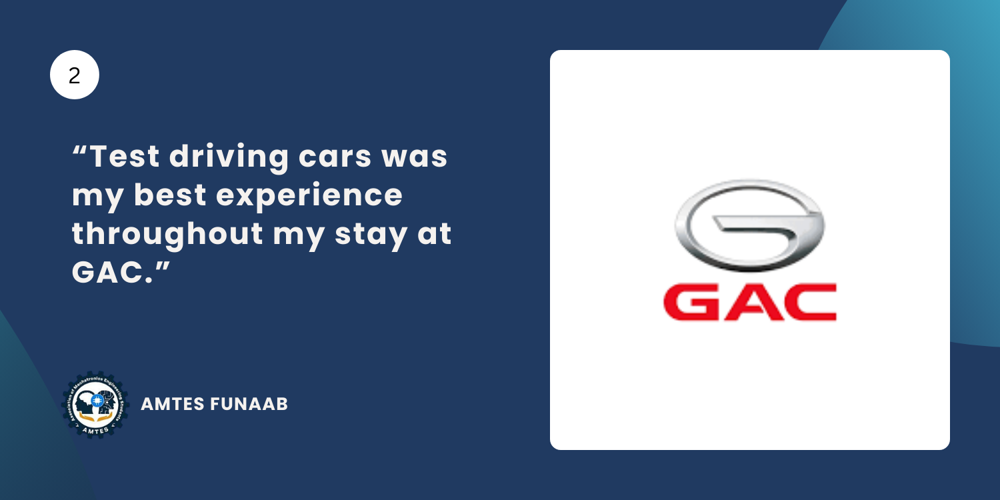
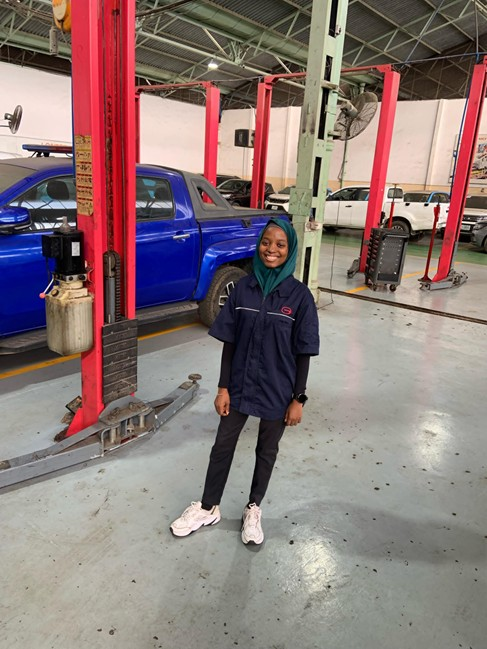
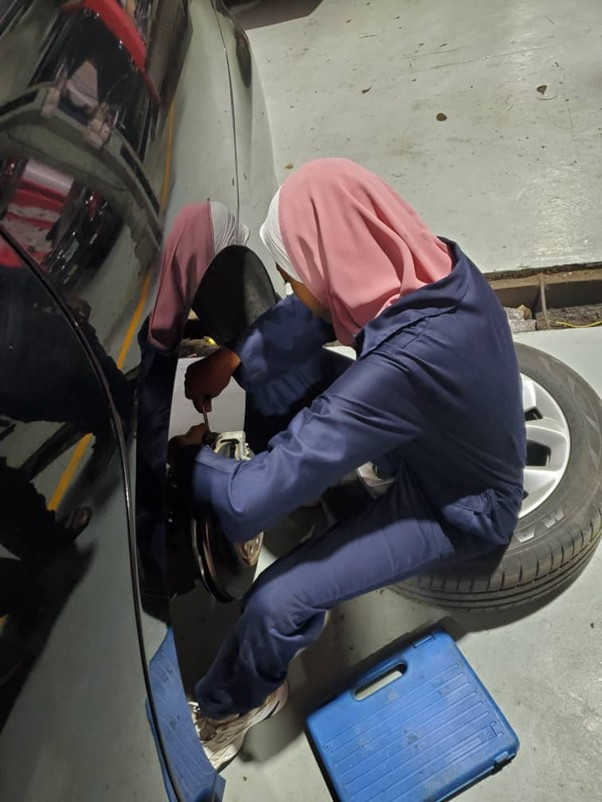

If you had told me a year earlier that I would eventually write an article about my IT experience, I would have laughed and asked, “Why? What happened that’s worth sharing?” But life has a funny way of proving you wrong. And today, here I am, typing out an experience I never thought would matter to anyone, maybe not even to me at the time.

When I was asked if I could share my story, my mind went into full panic mode. I didn’t think I had a “story” until I realized the story was already there, buried in the  moments I never really paused to appreciate. And like I’ve been telling myself lately: “Do it or don’t do it — you will regret both.”

So here we go. But, I must warn you, this is just an opportunity for me to rant off about my IT

## Getting a Placement

At the start of my 400-level first semester, I was one of the few people who felt shockingly calm about IT placement. While everyone else panicked, updated CVs, begged HR staff on LinkedIn, and ran around campus asking, “Where are you applying?”, I was chilling.

Why?

Because I had options. And options make you bold. I had someone who already assured me a place for me at GAC Motors. And worst-case scenario, I could always return to BHN, where I did my SIWES 1. I had a solid experience there, so going back wouldn’t have been a problem. By the time the semester ended, I had three official choices sitting comfortably in my mind:

1. GAC Motors 
2. BHN 
3. 7Up Bottling Company — recommended by someone else, but required an aptitude test

To me, this was the easiest decision ever. I wanted GAC. Not just because of the cars (okay, partly because of the cars), but because it felt like something different, something exciting. On February 26th, I walked into GAC headquarters in Victoria Island, feeling ready to start a new chapter. Little did I know that this chapter would have more _plot twists_ than a Nollywood series.

## The First Twist
After meeting the admin team, they assigned me to the Alausa branch, which was conveniently closer to home. Funny enough, this branch was literally neighbours with 7Up. They shared the same bus stop. Every morning, I would pass the huge 7Up factory before walking a little further to GAC.

I resumed the next day, full of energy, excitement, and anticipation…, only for all that energy to evaporate by the afternoon. Alausa was a new branch, and when I say “new,” I mean _empty_. There was barely any activity. Only minor services came in. Major repairs were sent off to other, more equipped branches.

By the third day, I was already having identity crises: “This can’t be my IT experience.” “Is this what I left BHN for?” “Why didn’t I choose 7Up?” “Why is life like this?”

I started questioning my decision-making skills like someone who bought a phone without checking the reviews. That weekend, I spoke to the person who recommended 7Up about pursuing the option. She agreed it might be worth considering. So I decided I would at least take their test. March 5th, I went for the 7Up aptitude test during my break from work. I mentioned they were close, so thankfully, I didn’t need to cross Lagos to chase an opportunity.

But life, sweet, dramatic life, had another surprise waiting for me.

## The Second Twist

Barely 48 hours after I wrote the 7Up test, something unexpected happened at Alausa. The branch was shutting down. Just like that. Everyone was being reassigned.

I was instructed to resume at the Ogba branch on Monday. I won’t lie, this news made me happy. Very happy. Because, as much as Alausa disappointed me, I still wanted to stay with GAC. I still wanted that automotive experience I had imagined. And I thought Ogba would be that.

But when I arrived at Ogba, HR informed me that it wasn't the aftersales experience I expected. It was an assembly plant, and unfortunately, there was no production going on at the time. So…, another transfer. I was directed to resume at the Ojota branch the next day.

And that was where my story truly began.

## My experience at the Ojota Branch
From the second I stepped into Ojota, it felt something different. The energy was different, warm, busy, structured, alive. It felt like a real workspace, a place where things happened, where knowledge circulated, where people grew.

For the first time since starting IT, I finally thought, “Yes. This is where I’m supposed to be.” I worked in a few departments here, and I'll be breaking them down in sub-sections.

### a) The CNG Conversion Department

My first assignment was in the CNG Conversion section. Here, I worked with a team of young adults converting petrol engines to run on Compressed Natural Gas. Let me tell you, **this section was the highlight of my entire experience**.

I loved everything about it: the technical problem-solving, the brainstorming sessions, the teamwork, the trial-and-error, and the willingness of everyone to both learn and teach. It fed my curiosity in a way I didn’t even realize I needed.

The work was hands-on, practical, engaging, and deeply satisfying. Unfortunately, I stayed there for less than two months. But those weeks remain some of my favorite memories from IT.

Whenever we had lighter workloads, they didn’t let us sit idle. Instead, I had the freedom to move around and observe other departments.

That was how I discovered the AC section, a department that ended up becoming another highlight of my journey.

### B) The AC Department

The AC section had one central principle: **Diagnose first. Repair later.** And the best part? Diagnosis required test driving.

Yes. Test-driving cars during IT. This was the best part of my IT experience. If you ask me what happiness looks like, I’ll show you a picture of me holding car keys.

During my two weeks there, I learned how to:
- diagnose AC system faults
- refill and measure refrigerant levels
- identify damaged components
- replace compressors, condensers, and evaporators
- understand pressure differences and cooling cycles

The AC section was the perfect blend of learning and enjoyment. It felt like a reward for surviving Alausa and Ogba. But soon, I was moved again.

### C) The Warehouse

The next section was the warehouse, and nothing could have prepared me for how long I would stay there. Almost three full months. It was my least favourite section.

Working here meant dealing with endless inventory tracking, sorting incoming parts, updating records, issuing parts to technicians, managing discrepancies, and participating in stock counts at month-end.

I spent hours behind a screen, typing numbers and arranging paperwork. It was repetitive. It was mentally draining. And it made each day feel like the longest of my whole IT.

I asked to be moved, but I got, “Who will take over your duties?” And just like that, guilt became my new coworker. I ended up staying until they got a new IT student. I trained her and finally closed that chapter.

### D) The Suspension and Quick Service Department

With barely a month left, I moved to the Suspension and Quick Service section. Quick Service was a walk in the park. I had already picked up most of it during my brief stay in Alausa.

Suspension work, however, was a beautiful new world. I learned about:
- shock absorbers
- stabilizer links
- bushing systems
- ball joints
- steering components
- and how all these affect handling and ride comfort

Even though the time was short, I enjoyed every moment. It felt like I was ending my IT on a high note.

## Things My IT Experience Taught Me

Looking back, my six months at GAC Motors taught me far more than I could have imagined. 

1. Not all beginnings feel right, but their endings can make everything worthwhile

When I first arrived at Alausa, I felt a deep sense of disappointment. Moving to Ogba felt like another setback. I questioned my choices and wondered if I had even made the right decision. And yet, when I finally arrived at Ojota, it all came together in a way that made me feel like I had truly found my place. This taught me an important lesson: sometimes the first steps in a journey don’t feel meaningful, but if you stay patient and open, the later stages can bring lessons and experiences that make every challenge along the way worth it.

2. Every experience has its own value, even the ones you think you’ll dislike

Looking back, I can see how each department contributed to my growth in unique ways. The CNG Conversion section taught me the value of creativity and innovation, pushing me to think outside the box when solving problems. The AC department showed me the importance of precision, attention to detail, and the satisfaction that comes from doing a task correctly. The warehouse, though far from glamorous, instilled a sense of responsibility and accountability; it reminded me that every role — no matter how mundane it seems — plays a huge  part in the bigger picture. Finally, working with Suspension and Quick Service exposed me to core mechanical systems and reinforced the importance of hands-on experience. Each section added a layer of learning that shaped my skills and mindset.

3. IT is also about discovering yourself

This experience made me realize that an internship is beyond what you learn from the machines or software you work with; it’s about learning who you are in the process. I discovered the types of tasks I truly enjoy and those that don’t spark my interest. I learned how to adapt when situations changed, how to ask questions confidently, and how to take ownership of my learning even when guidance wasn’t immediately available. IT challenged me to understand my strengths, my limits, and my capacity to grow when pushed outside my comfort zone.

4. People make experiences memorable

Ultimately, what made Ojota unforgettable wasn’t just the work itself; it was the people. From supportive colleagues to mentors who shared their knowledge freely, the people around me shaped my experience more than any task ever could. They made learning enjoyable, motivated me to push harder, and reminded me that a positive work environment can transform even the most challenging days into opportunities for growth and connection.

_Sekeenah Ayoola’s six-month IT experience at GAC Motors was full of unexpected twists, hands-on learning, and real moments of discovery. She not only gained practical skills across different departments but also learned how to adapt, take initiative, and make the most of every situation she found herself in. Her curiosity, determination, and willingness to jump in wherever needed turned challenges into opportunities, leaving her with experiences and insights that will stay with her long after the internship ended._

_From all of us at AMTES, we celebrate you!_

You can connect with her on [LinkedIn](https://www.linkedin.com/in/sekeenah-ayoola/).
